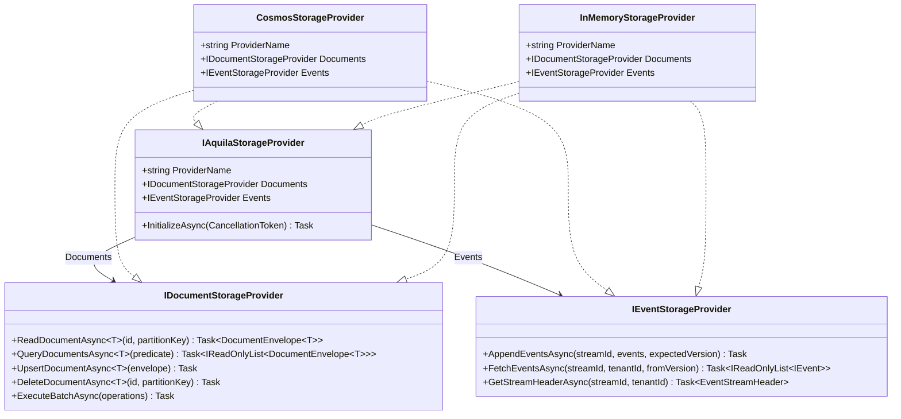
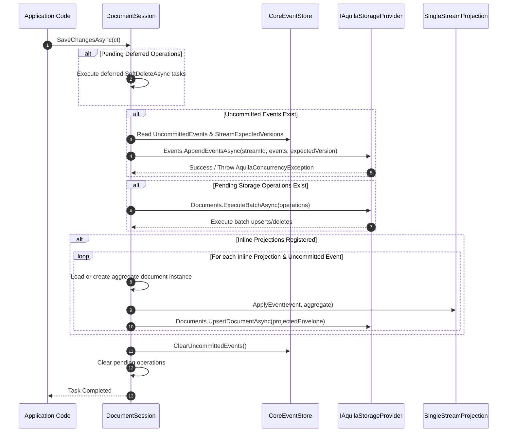
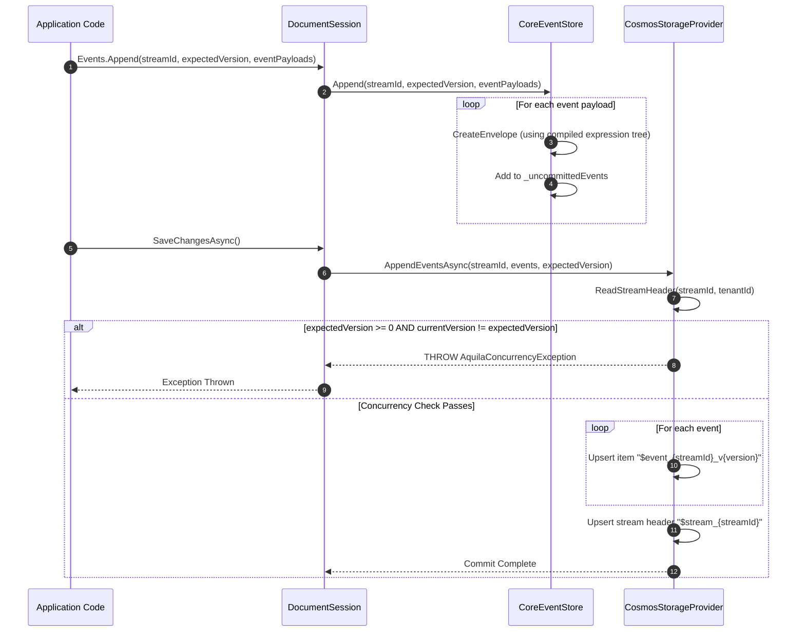
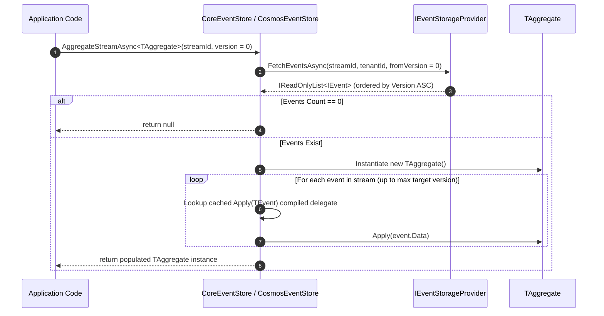

# Aquila Architecture & Design

This document details the architectural principles, SPI storage design, system flows, performance optimizations, and security controls powering the **Aquila** framework.

---

## 1. Solution Sitemap & Project Breakdown

The Aquila repository (`Aquila.slnx`) is organized into modular assemblies designed for clean separation of concerns and pluggable storage integration.

```
Aquila/
├── src/
│   ├── Aquila.Core/           # Core abstractions, sessions, engine, & in-memory SPI provider
│   └── Aquila.Cosmos/         # Azure Cosmos DB storage SPI provider implementation & DI extensions
├── samples/
│   └── Aquila.Samples/        # Executable sample application showcasing store setup & projections
└── tests/
    └── Aquila.Tests/          # Unit & integration test suite (xUnit, NSubstitute, Shouldly, AutoFixture)
```

### Project Responsibilities

| Project | Target Framework | Core Responsibilities |
| :--- | :--- | :--- |
| [`Aquila.Core`](file:///home/chad/source/dotnet/Aquila/src/Aquila.Core) | `net10.0` | Core abstractions (`IDocumentStore`, `IDocumentSession`, `IQuerySession`, `IEventStore`), session life-cycle management, Schema/Mapping policies, Projection engine (`SingleStreamProjection`), Storage Provider SPI contracts, and built-in [`InMemoryStorageProvider`](file:///home/chad/source/dotnet/Aquila/src/Aquila.Core/Storage/InMemoryStorageProvider.cs). |
| [`Aquila.Cosmos`](file:///home/chad/source/dotnet/Aquila/src/Aquila.Cosmos) | `net10.0` | Azure Cosmos DB implementation of [`IAquilaStorageProvider`](file:///home/chad/source/dotnet/Aquila/src/Aquila.Core/Storage/StorageContracts.cs#L71), custom Cosmos document envelopes (`CosmosDocumentEnvelope<T>`), direct LINQ/SQL query translators, and ASP.NET Core DI extensions (`AddAquila`, `UseCosmos`). |
| [`Aquila.Samples`](file:///home/chad/source/dotnet/Aquila/samples/Aquila.Samples) | `net10.0` | Runnable demonstration program illustrating document store configuration, event stream appending, aggregate rehydration, and inline projection handling. |
| [`Aquila.Tests`](file:///home/chad/source/dotnet/Aquila/tests/Aquila.Tests) | `net10.0` | Automated test suite verifying session contracts, storage providers, optimistic concurrency exceptions, projection lifecycles, and security boundary isolation. |

---

## 2. Pluggable Storage SPI Design

Aquila decouples business domain semantics (sessions, units-of-work, aggregates, and projections) from physical storage engines through the Service Provider Interface (SPI) defined in [`Aquila.Core.Storage`](file:///home/chad/source/dotnet/Aquila/src/Aquila.Core/Storage/StorageContracts.cs).



### Storage Envelope Format

All storage providers serialize documents using the unified [`DocumentEnvelope<T>`](file:///home/chad/source/dotnet/Aquila/src/Aquila.Core/Storage/StorageContracts.cs#L13) schema:

```csharp
public sealed class DocumentEnvelope<T>
{
    public string Id { get; set; } = string.Empty;
    public string PartitionKey { get; set; } = string.Empty;
    public string DocType { get; set; } = typeof(T).Name;
    public string TenantId { get; set; } = "default";
    public bool IsDeleted { get; set; }
    public string Version { get; set; } = Guid.NewGuid().ToString();
    public string? ETag { get; set; }
    public T Data { get; set; } = default!;
}
```

---

## 3. Sequence Flowcharts

### Document Session Commit Flow (`SaveChangesAsync`)

When [`DocumentSession.SaveChangesAsync()`](file:///home/chad/source/dotnet/Aquila/src/Aquila.Core/Sessions/DocumentSession.cs#L196) is invoked, Aquila flushes deferred operations, appends pending event streams, executes batch storage operations, and triggers registered inline projections.



---

### Event Stream Append Flow

Appending events validates expected versions, wraps event payloads into strongly typed [`EventEnvelope<T>`](file:///home/chad/source/dotnet/Aquila/src/Aquila.Core/Events/IEvent.cs#L31) wrappers, updates stream metadata headers, and persists items atomically.



---

### Aggregate Rehydration Flow (`AggregateStreamAsync`)

Aggregate rehydration fetches all events associated with a stream ID from storage and sequentially invokes matching `Apply(TEvent)` methods via compiled delegates.



---

## 4. Performance Optimizations & Security Controls

### Performance Optimizations

1. **Sealed Class Hierarchy**: Core internal and public infrastructure classes (e.g., `DocumentSession`, `QuerySession`, `DocumentStore`, `InMemoryStorageProvider`, `CosmosStorageProvider`, `DocumentEnvelope<T>`, `CosmosDocumentEnvelope<T>`, `StoreOptions`) are explicitly marked `sealed` to allow devirtualization and inline method optimization by the JIT compiler.
2. **Compiled Expression Trees for Reflection Hot-Paths**:
   - **ID Resolution**: [`DocumentMapping<T>`](file:///home/chad/source/dotnet/Aquila/src/Aquila.Core/Configuration/StoreOptions.cs#L9) compiles expression trees at startup to extract `Id`/`id` property values without runtime reflection overhead.
   - **Event Envelope Factory**: [`CoreEventStore`](file:///home/chad/source/dotnet/Aquila/src/Aquila.Core/Sessions/QuerySession.cs#L136) caches compiled `Func<string, long, object, string, IEvent>` delegates in a `ConcurrentDictionary` to instantiate generic `EventEnvelope<T>` instances without invoking `Activator.CreateInstance`.
   - **Aggregate Method Invocation**: `CoreEventStore` caches compiled `Action<object, object>` delegates targeting `Apply(TEvent)` methods on aggregates to eliminate reflection overhead during stream rehydration.
   - **Property Copier**: [`SingleStreamProjection<T>`](file:///home/chad/source/dotnet/Aquila/src/Aquila.Core/Projections/SingleStreamProjection.cs#L78) compiles static block expressions for copying properties between aggregate instances during projection execution.
3. **1-RU Point Read Execution**: [`CosmosStorageProvider.ReadDocumentAsync`](file:///home/chad/source/dotnet/Aquila/src/Aquila.Cosmos/Storage/CosmosStorageProvider.cs#L60) executes direct `ReadItemAsync` calls using both `Id` and `PartitionKey`, bypassing SQL parsing and utilizing Cosmos DB 1-RU point read efficiency.
4. **Sync-over-Async Prevention**: Calling synchronous `Query<T>()` throws `NotSupportedException` to prevent thread pool starvation in async web application workloads. Developers must use asynchronous `QueryAsync<T>()`.

---

### Security & Data Safety Controls

1. **Document State Snapshotting**:
   - Calling [`DocumentSession.Store(doc)`](file:///home/chad/source/dotnet/Aquila/src/Aquila.Core/Sessions/DocumentSession.cs#L23) immediately serializes and snapshots the document state. Subsequent mutations to the original object in application code do not pollute the pending unit-of-work state prior to `SaveChangesAsync()`.
2. **Strict Multi-Tenant Scoping & Data Isolation**:
   - Every `DocumentEnvelope<T>`, `CosmosDocumentEnvelope<T>`, and `EventStreamHeader` carries an immutable `TenantId`.
   - `QuerySession` and `DocumentSession` bind all queries and loads to the session's designated `TenantId`. Cross-tenant queries return `null` or filter out unauthorized tenant records.
3. **Cosmos DB SQL Injection Protection**:
   - All dynamic event fetching queries in [`CosmosStorageProvider.FetchEventsAsync`](file:///home/chad/source/dotnet/Aquila/src/Aquila.Cosmos/Storage/CosmosStorageProvider.cs#L233) use parameterized [`QueryDefinition`](file:///home/chad/source/dotnet/Aquila/src/Aquila.Cosmos/Storage/CosmosStorageProvider.cs#L241) objects (`@streamId`, `@fromVersion`, `@tenantId`), eliminating SQL injection vulnerabilities.
4. **Input Parameter Guards**:
   - All framework methods enforce `ArgumentNullException.ThrowIfNull` and `ArgumentException.ThrowIfNullOrWhiteSpace` checks across IDs, partition keys, stream names, and configuration parameters.
