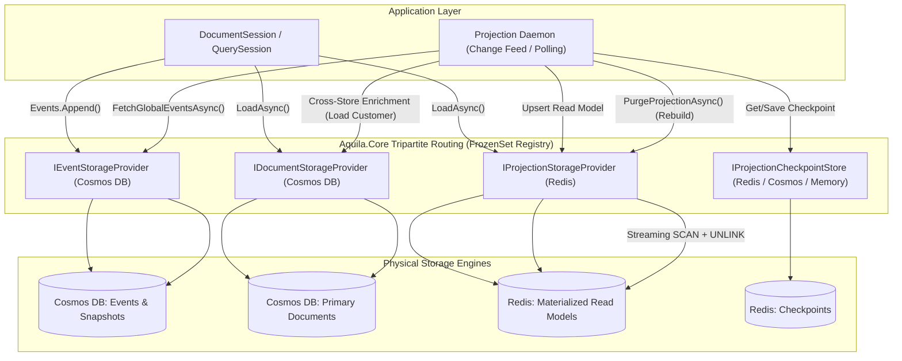
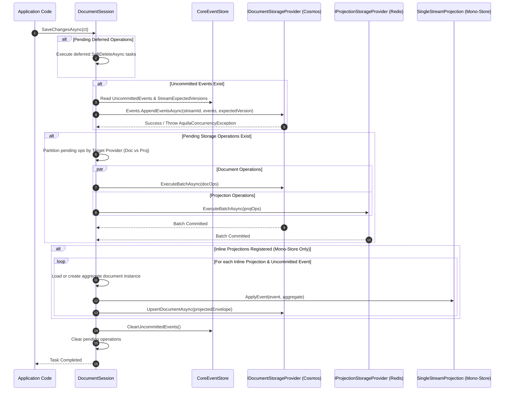
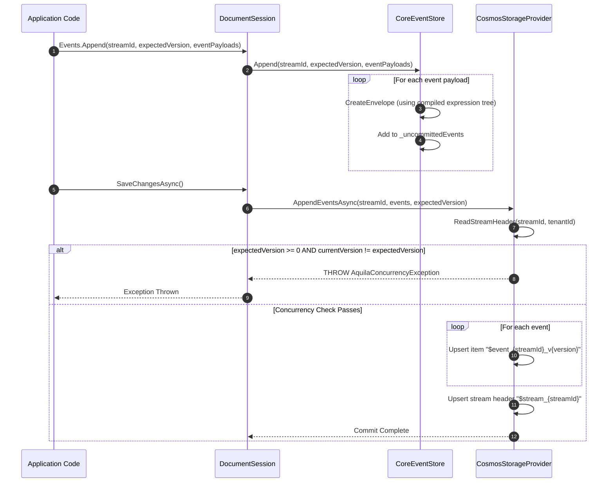
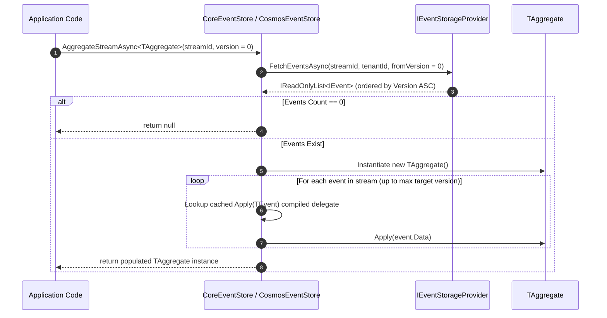
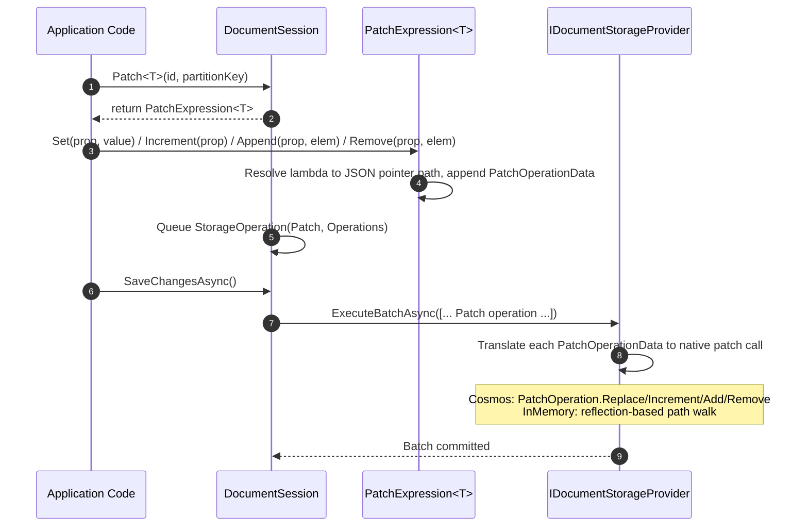
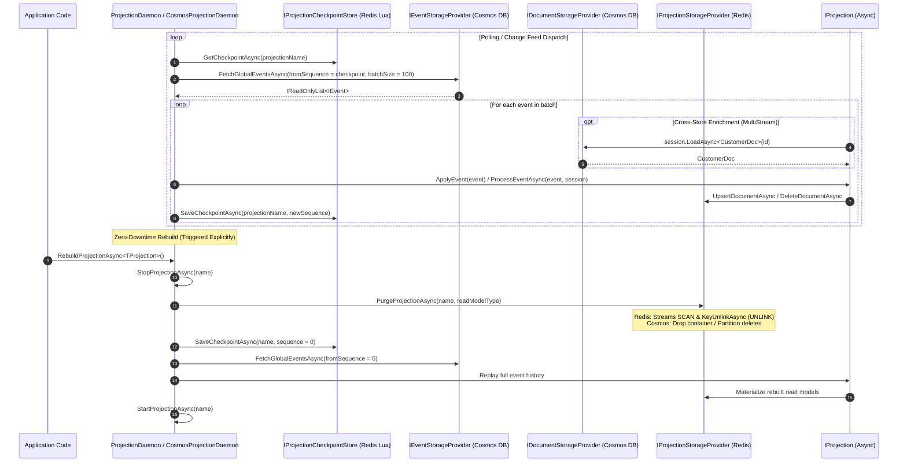
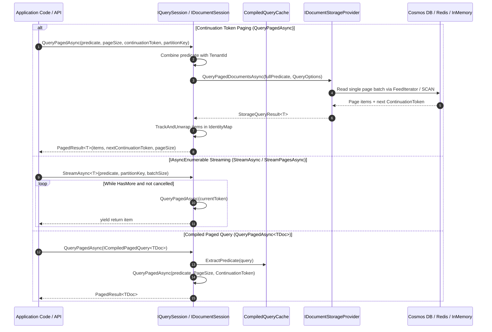

# Aquila Architecture & Design

This document details the architectural principles, tripartite SPI storage design, system flows, performance optimizations, and security controls powering the **Aquila** framework.

---

## 1. Solution Sitemap & Project Breakdown

The Aquila repository (`Aquila.slnx`) is organized into modular assemblies designed for clean separation of concerns and pluggable storage integration.

```
Aquila/
├── src/
│   ├── Aquila.Core/                    # Core SPI abstractions, session engines, event store & projections
│   │   ├── Abstractions/               # IDocumentStore, IDocumentSession, IQuerySession, IEventStore
│   │   ├── Configuration/               # StoreOptions, DocumentMapping<T>, SchemaPolicy, StoreMetadata
│   │   ├── Events/                     # IEvent, EventEnvelope<T>, IEventUpcaster, UpcasterRegistry, ISnapshotStrategy
│   │   ├── Exceptions/                 # AquilaException, AquilaConcurrencyException
│   │   ├── Patching/                   # IPatchExpression<T>, PatchExpression<T>
│   │   ├── Projections/                # IProjection, SingleStreamProjection<T>, MultiStreamProjection<TDoc,TId>
│   │   │   └── Daemon/                 # IProjectionDaemon, ProjectionDaemon, IProjectionCheckpointStore
│   │   ├── Queries/                    # ICompiledQuery<TDoc,TResult>, ICompiledPagedQuery<TDoc>, CompiledQueryCache, PagedResult<T>, SortOrder, SortOrderDefinition<T>, SortDescriptor
│   │   ├── Sessions/                   # DocumentSession, QuerySession, IIdentityMap, TrackingMode, DocumentStore
│   │   └── Storage/                    # StorageContracts (SPI), InMemoryStorageProvider, ISqlExpressionTranslator
│   ├── Aquila.Cosmos/                   # Azure Cosmos DB SPI storage providers & Cosmos event store
│   │   ├── Configuration/               # CosmosStorageOptions, CosmosProjectionContainerOptions
│   │   ├── Events/                     # CosmosEventStore
│   │   ├── Extensions/                 # ServiceCollectionExtensions (AddAquila, UseCosmos, UseCosmosDocuments, UseCosmosEvents, UseCosmosProjections), CosmosDaemonExtensions
│   │   ├── Projections/                # CosmosProjectionDaemon (Change Feed-aware)
│   │   └── Storage/                    # CosmosStorageProvider, CosmosDocumentStorageProvider, CosmosEventStorageProvider, CosmosProjectionStorageProvider, CosmosContainerResolver, CosmosPartitionKeyHelper, CosmosExpressionRewriter
│   └── Aquila.Redis/                    # High-performance Redis projection & document storage provider
│       ├── Configuration/               # RedisStorageOptions (KeyPrefix, Database, BatchChunkSize, SerializerOptions, Cluster Hash Tag Formatters)
│       ├── Extensions/                 # RedisServiceCollectionExtensions (UseRedisProjections, UseRedisDocuments, AddRedisCheckpointStore, AddAquilaRedis)
│       └── Storage/                    # RedisProjectionStorageProvider, RedisDocumentStorageProvider, RedisProjectionCheckpointStore
├── tests/
│   ├── Aquila.Core.Tests/              # Unit test suite for Aquila.Core (xUnit v3, NSubstitute, Shouldly)
│   ├── Aquila.Cosmos.Tests/            # Unit test suite for Aquila.Cosmos (xUnit v3, NSubstitute, Shouldly)
│   ├── Aquila.Redis.Tests/             # Unit and integration test suite for Aquila.Redis (xUnit v3, Testcontainers.Redis)
│   └── Aquila.Tests/                   # Solution-wide integration test suite
└── samples/
    └── Aquila.Samples/                 # Demo application showcasing pluggable mono-store and polyglot setups
```

### Project Responsibilities

| Project | Target Framework | Core Responsibilities |
| :--- | :--- | :--- |
| [`Aquila.Core`](file:///home/chad/source/dotnet/Aquila/src/Aquila.Core) | `net10.0` | Core abstractions ([`IDocumentStore`](file:///home/chad/source/dotnet/Aquila/src/Aquila.Core/Abstractions/IDocumentStore.cs#L86), [`IDocumentSession`](file:///home/chad/source/dotnet/Aquila/src/Aquila.Core/Abstractions/IDocumentStore.cs#L59), [`IQuerySession`](file:///home/chad/source/dotnet/Aquila/src/Aquila.Core/Abstractions/IDocumentStore.cs#L35), [`IEventStore`](file:///home/chad/source/dotnet/Aquila/src/Aquila.Core/Abstractions/IDocumentStore.cs#L14)), session lifecycle management ([`TrackingMode`](file:///home/chad/source/dotnet/Aquila/src/Aquila.Core/Sessions/TrackingMode.cs), [`IIdentityMap`](file:///home/chad/source/dotnet/Aquila/src/Aquila.Core/Sessions/IIdentityMap.cs)), schema/mapping policies, $O(1)$ zero-allocation type routing, projection engine ([`SingleStreamProjection<T>`](file:///home/chad/source/dotnet/Aquila/src/Aquila.Core/Projections/SingleStreamProjection.cs), [`MultiStreamProjection<TDoc,TId>`](file:///home/chad/source/dotnet/Aquila/src/Aquila.Core/Projections/MultiStreamProjection.cs)), async [`ProjectionDaemon`](file:///home/chad/source/dotnet/Aquila/src/Aquila.Core/Projections/Daemon/ProjectionDaemon.cs), partial document [`IPatchExpression<T>`](file:///home/chad/source/dotnet/Aquila/src/Aquila.Core/Patching/IPatchExpression.cs), [`PagedResult<T>`](file:///home/chad/source/dotnet/Aquila/src/Aquila.Core/Queries/PagedResult.cs), [`ICompiledPagedQuery<TDoc>`](file:///home/chad/source/dotnet/Aquila/src/Aquila.Core/Queries/ICompiledPagedQuery.cs), [`ICompiledQuery`](file:///home/chad/source/dotnet/Aquila/src/Aquila.Core/Queries/ICompiledQuery.cs) caching, `IAsyncEnumerable` streaming, event upcasting/snapshotting, Tripartite SPI contracts ([`IDocumentStorageProvider`](file:///home/chad/source/dotnet/Aquila/src/Aquila.Core/Storage/StorageContracts.cs#L78), [`IEventStorageProvider`](file:///home/chad/source/dotnet/Aquila/src/Aquila.Core/Storage/StorageContracts.cs#L92), [`IProjectionStorageProvider`](file:///home/chad/source/dotnet/Aquila/src/Aquila.Core/Storage/StorageContracts.cs#L153)), and [`InMemoryStorageProvider`](file:///home/chad/source/dotnet/Aquila/src/Aquila.Core/Storage/InMemoryStorageProvider.cs). |
| [`Aquila.Cosmos`](file:///home/chad/source/dotnet/Aquila/src/Aquila.Cosmos) | `net10.0` | Azure Cosmos DB implementations of [`IDocumentStorageProvider`](file:///home/chad/source/dotnet/Aquila/src/Aquila.Cosmos/Storage/CosmosDocumentStorageProvider.cs), [`IEventStorageProvider`](file:///home/chad/source/dotnet/Aquila/src/Aquila.Cosmos/Storage/CosmosEventStorageProvider.cs), and [`IProjectionStorageProvider`](file:///home/chad/source/dotnet/Aquila/src/Aquila.Cosmos/Storage/CosmosProjectionStorageProvider.cs), unified composite provider ([`CosmosStorageProvider`](file:///home/chad/source/dotnet/Aquila/src/Aquila.Cosmos/Storage/CosmosStorageProvider.cs)), hierarchical partition key resolution via [`CosmosPartitionKeyHelper`](file:///home/chad/source/dotnet/Aquila/src/Aquila.Cosmos/Storage/CosmosPartitionKeyHelper.cs), container routing via [`CosmosContainerResolver`](file:///home/chad/source/dotnet/Aquila/src/Aquila.Cosmos/Storage/CosmosContainerResolver.cs), LINQ predicate rewriting via [`CosmosExpressionRewriter`](file:///home/chad/source/dotnet/Aquila/src/Aquila.Cosmos/Storage/CosmosExpressionRewriter.cs), Change Feed-aware [`CosmosProjectionDaemon`](file:///home/chad/source/dotnet/Aquila/src/Aquila.Cosmos/Projections/CosmosProjectionDaemon.cs), and DI extensions (`AddAquila`, `UseCosmos`, `UseCosmosDocuments`, `UseCosmosEvents`, `UseCosmosProjections`, `AddCosmosDaemon`). |
| [`Aquila.Redis`](file:///home/chad/source/dotnet/Aquila/src/Aquila.Redis) | `net10.0` | Redis implementations of [`IProjectionStorageProvider`](file:///home/chad/source/dotnet/Aquila/src/Aquila.Redis/Storage/RedisProjectionStorageProvider.cs), [`IDocumentStorageProvider`](file:///home/chad/source/dotnet/Aquila/src/Aquila.Redis/Storage/RedisDocumentStorageProvider.cs), and [`IProjectionCheckpointStore`](file:///home/chad/source/dotnet/Aquila/src/Aquila.Redis/Storage/RedisProjectionCheckpointStore.cs). Features pipelined batch writes via `IBatch`, cluster hash tags (`{tenant:pk}`), UTF-8 direct serialization, non-blocking streaming `SCAN` + `UNLINK` purges for zero-RU rebuilds, monotonic Lua checkpoint progression scripts, and DI extensions (`UseRedisProjections`, `UseRedisDocuments`, `AddRedisCheckpointStore`, `AddAquilaRedis`). |
| [`Aquila.Samples`](file:///home/chad/source/dotnet/Aquila/samples/Aquila.Samples) | `net10.0` | Runnable demonstration application illustrating document store configuration, event stream appending, aggregate rehydration, and mono-store vs polyglot projection handling. |
| [`Aquila.Redis.Tests`](file:///home/chad/source/dotnet/Aquila/tests/Aquila.Redis.Tests) | `net10.0` | Unit and integration test suite verifying Redis document storage, projection storage, non-blocking purge, Lua monotonic checkpoint persistence, and end-to-end polyglot Cosmos DB + Redis execution using `Testcontainers.Redis`. |
| [`Aquila.Tests`](file:///home/chad/source/dotnet/Aquila/tests/Aquila.Tests) | `net10.0` | Automated test suite verifying session contracts, storage providers, optimistic concurrency exceptions, projection lifecycles, and security boundary isolation. |

---

## 2. Tripartite Polyglot Storage SPI Architecture

Aquila decouples business domain semantics (sessions, units-of-work, aggregates, and projections) from physical storage engines using a **Tripartite Polyglot Storage Architecture** comprising three independent, first-class SPI contracts defined in [`StorageContracts.cs`](file:///home/chad/source/dotnet/Aquila/src/Aquila.Core/Storage/StorageContracts.cs):

1. **`IEventStorageProvider`**: Append-only event streams, aggregate rehydration, global sequence streaming, and aggregate snapshots (e.g. Azure Cosmos DB, In-Memory).
2. **`IDocumentStorageProvider`**: Primary domain documents, dirty tracking, units of work, optimistic concurrency, and LINQ querying (e.g. Azure Cosmos DB, Redis, In-Memory).
3. **`IProjectionStorageProvider`**: Materialized read models, point views, high-throughput batch updates, native instantaneous zero-RU rebuilds ([`PurgeProjectionAsync`](file:///home/chad/source/dotnet/Aquila/src/Aquila.Core/Storage/StorageContracts.cs#L159)), and ultra-low latency reads (e.g. **Redis**, dedicated Cosmos DB read containers).

```mermaid
classDiagram
    class IDocumentStorageProvider {
        +string ProviderName
        +ReadDocumentAsync~T~(id, partitionKey) Task~DocumentEnvelope~T~~
        +QueryDocumentsAsync~T~(predicate, options) Task~IReadOnlyList~DocumentEnvelope~T~~~
        +QueryPagedDocumentsAsync~T~(predicate, options) Task~StorageQueryResult~T~~
        +UpsertDocumentAsync~T~(envelope) Task
        +DeleteDocumentAsync~T~(id, partitionKey) Task
        +ExecuteBatchAsync(operations) Task
    }
    class IEventStorageProvider {
        +string ProviderName
        +AppendEventsAsync(streamId, events, expectedVersion) Task
        +FetchEventsAsync(streamId, tenantId, fromVersion) Task~IReadOnlyList~IEvent~~
        +GetStreamHeaderAsync(streamId, tenantId) Task~EventStreamHeader~
        +SaveSnapshotAsync~TAggregate~(streamId, version, snapshot) Task
        +GetSnapshotAsync~TAggregate~(streamId, tenantId) Task
    }
    class IProjectionStorageProvider {
        +PurgeProjectionAsync(projectionName, readModelType) Task
    }
    class IProjectionCheckpointStore {
        +GetCheckpointAsync(projectionName) Task~long~
        +SaveCheckpointAsync(projectionName, sequence) Task
    }

    IProjectionStorageProvider --|> IDocumentStorageProvider

    class CosmosDocumentStorageProvider {
        +string ProviderName
    }
    class CosmosEventStorageProvider {
        +string ProviderName
    }
    class CosmosProjectionStorageProvider {
        +string ProviderName
        +PurgeProjectionAsync(...) Task
    }
    class CosmosStorageProvider {
        +string ProviderName
        -_documents CosmosDocumentStorageProvider
        -_events CosmosEventStorageProvider
        -_projections CosmosProjectionStorageProvider
    }
    class RedisDocumentStorageProvider {
        +string ProviderName
        -_multiplexer IConnectionMultiplexer
    }
    class RedisProjectionStorageProvider {
        +string ProviderName
        -_innerDocumentProvider RedisDocumentStorageProvider
        +PurgeProjectionAsync(...) Task
    }
    class RedisProjectionCheckpointStore {
        -_multiplexer IConnectionMultiplexer
        +GetCheckpointAsync(...) Task
        +SaveCheckpointAsync(...) Task
    }
    class InMemoryStorageProvider {
        +string ProviderName
    }

    CosmosDocumentStorageProvider ..|> IDocumentStorageProvider
    CosmosEventStorageProvider ..|> IEventStorageProvider
    CosmosProjectionStorageProvider ..|> IProjectionStorageProvider
    CosmosStorageProvider ..|> IDocumentStorageProvider
    CosmosStorageProvider ..|> IEventStorageProvider
    CosmosStorageProvider ..|> IProjectionStorageProvider

    RedisDocumentStorageProvider ..|> IDocumentStorageProvider
    RedisProjectionStorageProvider ..|> IProjectionStorageProvider
    RedisProjectionCheckpointStore ..|> IProjectionCheckpointStore

    InMemoryStorageProvider ..|> IDocumentStorageProvider
    InMemoryStorageProvider ..|> IEventStorageProvider
    InMemoryStorageProvider ..|> IProjectionStorageProvider
```



---

### Polyglot System Topology & Type Routing

In a polyglot deployment, developers interact exclusively with the standard unified session APIs ([`IDocumentSession`](file:///home/chad/source/dotnet/Aquila/src/Aquila.Core/Abstractions/IDocumentStore.cs#L59) / [`IQuerySession`](file:///home/chad/source/dotnet/Aquila/src/Aquila.Core/Abstractions/IDocumentStore.cs#L35)). At initialization time, [`StoreOptions.Freeze()`](file:///home/chad/source/dotnet/Aquila/src/Aquila.Core/Configuration/StoreOptions.cs#L235) builds an immutable `FrozenSet<Type>` registry of all registered projection read-model types.

During session execution:
- Calls to `LoadAsync<T>()`, `QueryAsync<T>()`, `QueryPagedAsync<T>()`, or `StreamAsync<T>()` inspect `Options.IsProjectionReadModel(typeof(T))`.
- If `true`, the operation is routed with zero runtime allocation to `ProjectionStorage` (e.g. Redis).
- If `false`, the operation is routed to `DocumentStorage` (e.g. Cosmos DB).



---

### Storage Envelope Format

All storage providers serialize documents using the unified [`DocumentEnvelope<T>`](file:///home/chad/source/dotnet/Aquila/src/Aquila.Core/Storage/StorageContracts.cs#L13) schema:

```csharp
public sealed class DocumentEnvelope<T>
{
    public string Id { get; set; } = string.Empty;
    public string PartitionKey { get; set; } = string.Empty;
    public string DocType { get; set; } = typeof(T).Name;
    public string TenantId { get; set; } = "default";
    public bool IsDeleted { get; set; }
    public string Version { get; set; } = Guid.NewGuid().ToString();
    public string? ETag { get; set; }
    public T Data { get; set; } = default!;
}
```

---

## 3. Sequence Flowcharts

### Document Session Commit Flow (`SaveChangesAsync`)

When [`DocumentSession.SaveChangesAsync()`](file:///home/chad/source/dotnet/Aquila/src/Aquila.Core/Sessions/DocumentSession.cs#L196) is invoked, Aquila flushes deferred operations, appends pending event streams, partitions pending operations between `DocumentStorage` and `ProjectionStorage`, and processes inline projections (in mono-store setups).



---

### Polyglot Fail-Fast Startup Validation

To eliminate distributed dual-write inconsistencies, Aquila strictly validates projection lifecycles during store initialization:

```mermaid
sequenceDiagram
    autonumber
    participant App as Application / Startup
    participant Opt as StoreOptions
    participant Store as DocumentStore

    App->>Opt: UseCosmos(...) (Sets DocumentStorage & EventStorage)
    App->>Opt: UseRedisProjections(...) (Sets ProjectionStorage)
    App->>Opt: Projections.Add<MyProjection>(Lifecycle)
    App->>Store: new DocumentStore(options)
    Store->>Opt: Freeze()
    
    Opt->>Opt: Compare ReferenceEquals(ProjectionStorage, EventStorage)
    alt IsPolyglot AND Any Projection has ProjectionLifecycle.Inline
        Opt-->>Store: THROW InvalidOperationException (Dual-write hazard without 2PC)
        Store-->>App: Startup Aborted with Actionable Error Message
    else Valid Polyglot (Async or Live Lifecycles) OR Mono-Store
        Opt->>Opt: Compile FrozenSet<Type> ReadModel Registry
        Opt->>Opt: Set IsFrozen = true
        Store-->>App: Initialization Succeeded
    end
```

---

### Event Stream Append Flow

Appending events validates expected versions, wraps event payloads into strongly typed [`EventEnvelope<T>`](file:///home/chad/source/dotnet/Aquila/src/Aquila.Core/Events/IEvent.cs#L31) wrappers, updates stream metadata headers, and persists items atomically.



---

### Aggregate Rehydration Flow (`AggregateStreamAsync`)

Aggregate rehydration fetches all events associated with a stream ID from storage and sequentially invokes matching `Apply(TEvent)` methods via compiled delegates.



---

### Partial Document Patch Flow

`Patch<T>()` defers JSON-pointer path resolution and operation queuing until `SaveChangesAsync()`, allowing Cosmos DB to apply mutations server-side without a full document round-trip.



---

### Async Projection Daemon — Catch-Up & Zero-Downtime Rebuild Flow

`ProjectionLifecycle.Async` projections are decoupled from the write path. A background `IProjectionDaemon` polls the global event sequence or processes the Cosmos DB Change Feed, applies event batches to read models stored in `IProjectionStorageProvider` (Redis), and advances durable checkpoints in `IProjectionCheckpointStore`.

Zero-downtime rebuilds execute instantaneous, non-blocking key purges via `PurgeProjectionAsync` on Redis before replaying full event history from sequence `0`.



---

### Paging, Streaming & Compiled Paged Queries Flow

Pagination in Aquila prioritizes constant-RU cursor paging via continuation tokens while also supporting asynchronous `IAsyncEnumerable<T>` streaming, LINQ offset paging, and compiled paged queries.



---

## 4. Performance Optimizations & Security Controls

### Performance Optimizations

1. **$O(1)$ Zero-Allocation Type Routing**: [`StoreOptions.Freeze()`](file:///home/chad/source/dotnet/Aquila/src/Aquila.Core/Configuration/StoreOptions.cs#L235) builds an immutable `FrozenSet<Type>` of registered read models. In `QuerySession` and `DocumentSession`, type checks execute with $O(1)$ efficiency and zero memory allocation.
2. **Pipelined Batching with Redis `IBatch`**: [`RedisDocumentStorageProvider.ExecuteBatchAsync`](file:///home/chad/source/dotnet/Aquila/src/Aquila.Redis/Storage/RedisDocumentStorageProvider.cs) queues multi-document mutations via `IDatabase.CreateBatch()` before awaiting tasks, consolidating commands into a single TCP frame to reduce network latency from $O(N \times \text{RTT})$ to $1 \times \text{RTT}$.
3. **Cluster-Slot Co-Location via Hash Tags**: [`RedisStorageOptions.BuildKey`](file:///home/chad/source/dotnet/Aquila/src/Aquila.Redis/Configuration/RedisStorageOptions.cs#L33) formats keys as `{KeyPrefix}{{{tenantId}:{partitionKey}}}:{docType}:{id}`. The `{tenantId:partitionKey}` hash tag ensures co-located records reside on the same Redis cluster slot (preventing `CROSSSLOT` errors) while balancing partitions across cluster nodes.
4. **Non-Blocking Key Purge via Streaming `SCAN` + `UNLINK`**: Instantaneous projection rebuilds stream keys via `server.KeysAsync(...)` without buffering the entire keyspace in memory, and dispatch chunked `KeyUnlinkAsync` (`UNLINK`) for asynchronous, non-blocking memory reclamation on the Redis engine.
5. **Lock-Free Monotonic Lua Checkpoint Progression**: [`RedisProjectionCheckpointStore.SaveCheckpointAsync`](file:///home/chad/source/dotnet/Aquila/src/Aquila.Redis/Storage/RedisProjectionCheckpointStore.cs) runs an atomic Lua script (`if seq > cur then redis.call('SET', key, seq)`), ensuring checkpoint sequence numbers strictly advance monotonically during daemon failover without external distributed locks.
6. **Zero-Allocation Direct UTF-8 Byte Serialization**: `Aquila.Redis` serializes and deserializes `DocumentEnvelope<T>` directly to and from `ReadOnlyMemory<byte>` and `byte[]` buffers using `System.Text.Json`, avoiding intermediate string allocations and ensuring Native AOT compatibility.
7. **Sealed Class Hierarchy**: Core internal and public infrastructure classes (`DocumentSession`, `QuerySession`, `DocumentStore`, `InMemoryStorageProvider`, `CosmosStorageProvider`, `RedisProjectionStorageProvider`, `DocumentEnvelope<T>`, `StoreOptions`) are explicitly marked `sealed` for JIT devirtualization and aggressive inlining.
8. **Compiled Expression Trees for Reflection Hot-Paths**:
   - **ID Resolution**: [`DocumentMapping<T>`](file:///home/chad/source/dotnet/Aquila/src/Aquila.Core/Configuration/StoreOptions.cs#L9) compiles expression trees at startup to extract ID property values without runtime reflection.
   - **Event Envelope Factory**: [`CoreEventStore`](file:///home/chad/source/dotnet/Aquila/src/Aquila.Core/Sessions/QuerySession.cs#L136) caches compiled `Func<string, long, object, string, IEvent>` delegates in a `ConcurrentDictionary`.
   - **Aggregate Method Invocation**: `CoreEventStore` caches compiled `Action<object, object>` delegates targeting `Apply(TEvent)` methods on aggregates to eliminate reflection during stream rehydration.
   - **Property Copier**: [`SingleStreamProjection<T>`](file:///home/chad/source/dotnet/Aquila/src/Aquila.Core/Projections/SingleStreamProjection.cs#L78) compiles static block expressions for copying properties between aggregate instances during projection execution.
9. **1-RU Point Read Execution**: [`CosmosStorageProvider.ReadDocumentAsync`](file:///home/chad/source/dotnet/Aquila/src/Aquila.Cosmos/Storage/CosmosStorageProvider.cs#L60) executes direct `ReadItemAsync` calls using `Id` and `PartitionKey`, bypassing SQL parsing and utilizing Cosmos DB 1-RU point read efficiency.
10. **Async-First Execution**: The query subsystem is strictly non-blocking and asynchronous (`QueryAsync<T>()`, `QueryPagedAsync<T>()`, `StreamAsync<T>()`), preventing sync-over-async thread pool starvation.
11. **Compiled Query Caching**: [`CompiledQueryCache`](file:///home/chad/source/dotnet/Aquila/src/Aquila.Core/Queries/CompiledQueryCache.cs) compiles each `ICompiledQuery<TDoc,TResult>` type's `QueryIs()` expression tree into a delegate exactly once, rewriting parameter closures for reuse.
12. **Compiled Event Upcasting**: [`UpcasterRegistry`](file:///home/chad/source/dotnet/Aquila/src/Aquila.Core/Events/UpcasterRegistry.cs) builds a compiled expression-tree factory to copy `IEvent` metadata onto new event shapes after an upcast without reflection.

---

### Security & Data Safety Controls

1. **Polyglot Fail-Fast Guardrail**:
   - Prevents distributed dual writes: Attempting to configure `ProjectionLifecycle.Inline` when `ProjectionStorage` and `EventStorage` are separate physical stores throws an `InvalidOperationException` on startup.
2. **Document State Snapshotting**:
   - Calling [`DocumentSession.Store(doc)`](file:///home/chad/source/dotnet/Aquila/src/Aquila.Core/Sessions/DocumentSession.cs#L23) immediately serializes and snapshots the document state. Subsequent mutations to the original object in application code do not pollute the pending unit-of-work state prior to `SaveChangesAsync()`.
3. **Strict Multi-Tenant Scoping & Data Isolation**:
   - Every `DocumentEnvelope<T>`, `CosmosDocumentEnvelope<T>`, and `EventStreamHeader` carries an immutable `TenantId`.
   - `QuerySession` and `DocumentSession` bind all queries and loads to the session's designated `TenantId`. Cross-tenant queries return `null` or filter out unauthorized tenant records.
4. **Cosmos DB SQL Injection Protection**:
   - All dynamic event fetching queries in [`CosmosStorageProvider.FetchEventsAsync`](file:///home/chad/source/dotnet/Aquila/src/Aquila.Cosmos/Storage/CosmosStorageProvider.cs#L233) use parameterized [`QueryDefinition`](file:///home/chad/source/dotnet/Aquila/src/Aquila.Cosmos/Storage/CosmosStorageProvider.cs#L241) objects (`@streamId`, `@fromVersion`, `@tenantId`), eliminating SQL injection vulnerabilities.
5. **Input Parameter Guards**:
   - All framework methods enforce `ArgumentNullException.ThrowIfNull` and `ArgumentException.ThrowIfNullOrWhiteSpace` checks across IDs, partition keys, stream names, and configuration parameters.
