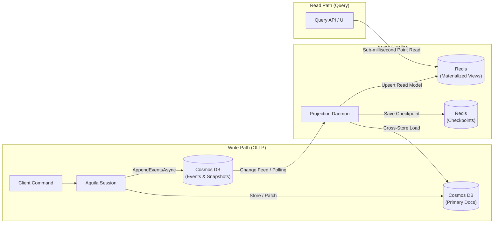

# Aquila Usage & Feature Guide

This guide provides detailed documentation and working code examples for all core features of the **Aquila** framework.

---

## 1. Document Mapping Policies

Aquila allows you to customize document identity, partition key routing, soft delete behavior, and optimistic concurrency rules using the fluent [`SchemaPolicy`](file:///home/chad/source/dotnet/Aquila/src/Aquila.Core/Configuration/StoreOptions.cs#L85) API.

### Configuration Example

```csharp
using Aquila.Core.Configuration;

var options = new StoreOptions();

options.Schema.For<Product>()
    .Identity(p => p.Sku)                           // Custom document ID selector
    .PartitionKey(p => p.Category)                  // Custom partition key selector
    .SoftDeleted()                                  // Enable soft delete behavior
    .UseOptimisticConcurrency(enabled: true);        // Require version checks
```

### Identity Resolution Defaults

- If `.Identity(...)` is omitted, Aquila automatically searches for a property named `Id` or `id` on the target type and compiles a fast getter expression.
- If no `Id` property exists, Aquila falls back to generating a new `Guid.NewGuid().ToString()` upon document storage.

### Partition Key Routing Defaults

- If `.PartitionKey(...)` is omitted, Aquila defaults the partition key to the C# class type name (`typeof(T).Name`).
- **Hierarchical Partition Keys**: When targeting Azure Cosmos DB containers with hierarchical partition keys, pass pipe-delimited values (e.g. `"TenantA|Region1|Dept5"`). Aquila's `CosmosPartitionKeyHelper` automatically splits the key on `'|'` and uses Cosmos DB's native `PartitionKeyBuilder` to construct multi-level partition keys.

---

## 2. Soft Delete Management

Aquila supports soft deletes out of the box. Soft-deleted documents remain stored in the underlying persistence layer with `IsDeleted = true` but are automatically filtered out of all [`LoadAsync`](file:///home/chad/source/dotnet/Aquila/src/Aquila.Core/Abstractions/IDocumentStore.cs#L39), [`LoadManyAsync`](file:///home/chad/source/dotnet/Aquila/src/Aquila.Core/Abstractions/IDocumentStore.cs#L41), and [`QueryAsync`](file:///home/chad/source/dotnet/Aquila/src/Aquila.Core/Abstractions/IDocumentStore.cs#L44) operations.

### Soft Delete APIs

```csharp
using Aquila.Core.Abstractions;

public async Task SoftDeleteExamplesAsync(IDocumentSession session, Order order)
{
    // 1. Soft delete by entity instance (synchronous queue)
    session.SoftDelete(order);

    // 2. Soft delete by ID and explicit partition key (synchronous queue)
    session.SoftDelete<Order>(id: "ORD-5001", partitionKey: "Electronics");

    // 3. Asynchronous soft delete by entity instance
    await session.SoftDeleteAsync(order);

    // 4. Asynchronous soft delete by ID (fetches existing record before flagging)
    await session.SoftDeleteAsync<Order>(id: "ORD-5002", partitionKey: "Electronics");

    // Commit changes to persistence provider
    await session.SaveChangesAsync();
}
```

---

## 3. Optimistic Concurrency Control

Aquila enforces optimistic concurrency controls during event stream appends and batch document mutations to prevent concurrent write collisions.

### Handling Concurrency Exceptions

When appending events with an explicit `expectedVersion`, Aquila validates that the stream's current version matches `expectedVersion`. If a mismatch occurs, an [`AquilaConcurrencyException`](file:///home/chad/source/dotnet/Aquila/src/Aquila.Core/Exceptions/AquilaException.cs) is raised.

```csharp
using Aquila.Core.Exceptions;

try
{
    using var session = store.OpenSession();
    
    // Attempt to append with expected version check
    session.Events.Append(
        streamId: "stream-123",
        expectedVersion: 5,
        new PaymentProcessed("stream-123", 150.00m)
    );

    await session.SaveChangesAsync();
}
catch (AquilaConcurrencyException ex)
{
    Console.WriteLine($"Concurrency conflict detected on stream '{ex.StreamId}'!");
    Console.WriteLine($"Expected Version: {ex.ExpectedVersion}, Actual Version: {ex.ActualVersion}");
}
```

---

## 4. Event Sourcing & Aggregate Streams

Aquila provides an event store subsystem accessed via [`session.Events`](file:///home/chad/source/dotnet/Aquila/src/Aquila.Core/Abstractions/IDocumentStore.cs#L37).

### 1. Starting an Event Stream

```csharp
var streamId = Guid.NewGuid().ToString();

using var session = store.OpenSession();

session.Events.StartStream<AccountAggregate>(streamId,
    new AccountOpened(streamId, Owner: "Alice", InitialBalance: 500.00m),
    new MoneyDeposited(streamId, Amount: 200.00m)
);

await session.SaveChangesAsync();
```

### 2. Appending Events to Existing Streams

```csharp
using var session = store.OpenSession();

// Append without explicit expected version check
session.Events.Append(streamId, new MoneyWithdrawn(streamId, Amount: 50.00m));

// Append with explicit expected version check (concurrency control)
session.Events.Append(streamId, expectedVersion: 3, new MoneyWithdrawn(streamId, Amount: 100.00m));

await session.SaveChangesAsync();
```

### 3. Fetching Event Streams

```csharp
using var session = store.OpenSession();

// Fetch all events for a stream
IReadOnlyList<IEvent> allEvents = await session.Events.FetchStreamAsync(streamId);

// Fetch events starting from version 2
IReadOnlyList<IEvent> partialEvents = await session.Events.FetchStreamAsync(streamId, fromVersion: 2);
```

### 4. Aggregate Rehydration

Aggregates rehydrate their state by defining `Apply(TEvent)` methods for each domain event.

```csharp
public class AccountAggregate
{
    public string Id { get; set; } = string.Empty;
    public string Owner { get; set; } = string.Empty;
    public decimal Balance { get; set; }

    public void Apply(AccountOpened @event)
    {
        Id = @event.AccountId;
        Owner = @event.Owner;
        Balance = @event.InitialBalance;
    }

    public void Apply(MoneyDeposited @event)
    {
        Balance += @event.Amount;
    }

    public void Apply(MoneyWithdrawn @event)
    {
        Balance -= @event.Amount;
    }
}

// Rehydrate aggregate state up to current version
var account = await session.Events.AggregateStreamAsync<AccountAggregate>(streamId);

// Rehydrate aggregate state up to specific historical version
var historicalAccount = await session.Events.AggregateStreamAsync<AccountAggregate>(streamId, version: 2);
```

---

## 5. SingleStreamProjections

Projections transform event streams into materialized read-model documents automatically.

### Projection Implementation

Inherit from [`SingleStreamProjection<TAggregate>`](file:///home/chad/source/dotnet/Aquila/src/Aquila.Core/Projections/SingleStreamProjection.cs#L36) and register handlers in the constructor using `CreateEvent` and `ProjectEvent`.

```csharp
using Aquila.Core.Projections;

public class AccountSummaryProjection : SingleStreamProjection<AccountAggregate>
{
    public AccountSummaryProjection()
    {
        // Initial creation handler for stream initialization
        CreateEvent<AccountOpened>(e => new AccountAggregate
        {
            Id = e.AccountId,
            Owner = e.Owner,
            Balance = e.InitialBalance
        });

        // Subsequent event transformation handlers
        ProjectEvent<MoneyDeposited>((e, agg) => agg.Balance += e.Amount);
        ProjectEvent<MoneyWithdrawn>((e, agg) => agg.Balance -= e.Amount);
    }
}
```

### Projection Lifecycles

Register projections with desired lifecycles in `StoreOptions`:

```csharp
options.Projections.Add<AccountSummaryProjection>(ProjectionLifecycle.Inline);
```

- **`ProjectionLifecycle.Inline`**: Executes synchronously inside `SaveChangesAsync()`. Aggregate read-models are stored in the document store within the same transactional commit (mono-provider setups only).
- **`ProjectionLifecycle.Async`**: Processed in the background by `IProjectionDaemon` (ideal for polyglot Redis projections or Change Feed dispatchers).
- **`ProjectionLifecycle.Live`**: Evaluated on-the-fly via `session.LiveStreamAsync<TDoc>(streamId)` without persisting read models.

---

## 6. Multi-Tenancy & Tenant Isolation

Aquila provides native multi-tenant isolation across all document and event store operations.

### Configuring Default Tenant ID

```csharp
services.AddAquila(options =>
{
    options.DefaultTenantId = "tenant-central";
});
```

### Opening Tenant-Scoped Sessions

Pass a tenant ID when opening sessions to guarantee cross-tenant data isolation:

```csharp
// Open document session isolated to Tenant Alpha
using var alphaSession = store.OpenSession(tenantId: "tenant-alpha");

alphaSession.Store(new Customer { Id = "C-1", Name = "Alpha Corp" });
await alphaSession.SaveChangesAsync();

// Open query session isolated to Tenant Beta
using var betaSession = store.QuerySession(tenantId: "tenant-beta");

// Attempts to load Tenant Alpha's document from Tenant Beta session will return null
var customer = await betaSession.LoadAsync<Customer>("C-1"); // Returns null
```

### Tenant Isolation in Event Store

Event streams, event envelopes, and stream headers track the `TenantId`. Appending or fetching streams inside a tenant-scoped session guarantees events are isolated from other tenants.

---

## 7. Session Tracking Modes

Every session — query or document — operates under a [`TrackingMode`](file:///home/chad/source/dotnet/Aquila/src/Aquila.Core/Sessions/TrackingMode.cs) that governs identity-map caching and dirty-checking behavior. Choose the mode based on the read/write pattern of the unit of work.

| Mode | Identity Map | Dirty Checking | Typical Use |
| :--- | :--- | :--- | :--- |
| `TrackingMode.Lightweight` | Disabled | None | High-throughput read-only queries or one-off writes where tracking overhead is unnecessary. `Store()` still queues a write, but repeated `LoadAsync` calls always re-fetch from storage. |
| `TrackingMode.IdentityMap` | Enabled | None | Ensures the same logical document returns the same CLR instance within a session, but requires explicit `Store()` calls to persist mutations. |
| `TrackingMode.DirtyTracking` (default) | Enabled | Automatic (JSON snapshot diff) | Load-mutate-`SaveChangesAsync()` workflows. Every loaded/tracked document is snapshotted; on `SaveChangesAsync()`, Aquila re-serializes tracked entities and diffs the bytes to auto-queue changed documents without an explicit `Store()` call. |

```csharp
using Aquila.Core.Sessions;

// Explicit tracking mode selection
using var session = store.OpenSession(TrackingMode.DirtyTracking);

var customer = await session.LoadAsync<Customer>("C-1");
customer!.Email = "updated@example.com"; // Mutate the tracked instance directly

// No explicit Store() call needed — DirtyTracking detects the change via snapshot diff
await session.SaveChangesAsync();

// Lightweight sessions skip identity map and dirty-checking overhead entirely
using var lightweight = store.LightweightSession();
var readOnly = await lightweight.LoadAsync<Customer>("C-1");
```

Dirty checking is implemented in [`DocumentSession.DetectAndQueueDirtyEntities`](file:///home/chad/source/dotnet/Aquila/src/Aquila.Core/Sessions/DocumentSession.cs#L305), which walks all entities tracked in the [`IIdentityMap`](file:///home/chad/source/dotnet/Aquila/src/Aquila.Core/Sessions/IIdentityMap.cs), re-serializes each with `System.Text.Json`, and compares the resulting UTF-8 bytes against the snapshot recorded at load/store time.

---

## 8. Partial Document Patching

For high-frequency, low-payload mutations (counters, status flags, list append/remove), Aquila exposes a fluent [`IPatchExpression<T>`](file:///home/chad/source/dotnet/Aquila/src/Aquila.Core/Patching/IPatchExpression.cs) API that translates property-lambda expressions into JSON-pointer paths, avoiding full document read-modify-write round-trips.

```csharp
using var session = store.OpenSession();

session.Patch<Order>(id: "ORD-1001", partitionKey: "Electronics")
    .Set(o => o.Status, "Shipped")
    .Increment(o => o.RevisionNumber)          // defaults to +1
    .Append(o => o.Tags, "expedited")
    .Remove(o => o.Tags, "backorder");

await session.SaveChangesAsync();
```

### Supported Patch Operations

| Method | Behavior |
| :--- | :--- |
| `Set(property, value)` | Replaces the property value at the resolved JSON pointer path. |
| `Increment(property, value = 1)` | Atomically increments a numeric property. On Cosmos DB this maps to `PatchOperation.Increment`, executed server-side. |
| `Append(property, element)` | Appends an element to a collection property (`PatchOperation.Add` at the `/-` array-tail index on Cosmos). |
| `Remove(property, element)` | Removes a matching element from a collection property. |

Patch paths are resolved by walking the property-access lambda into a `/Data/PropertyName[/NestedProperty...]` JSON pointer (see [`PatchExpression<T>.BuildJsonPointerPath`](file:///home/chad/source/dotnet/Aquila/src/Aquila.Core/Patching/PatchExpression.cs#L68)). `Patch<T>()` queues a `StorageOperationType.Patch` [`StorageOperation`](file:///home/chad/source/dotnet/Aquila/src/Aquila.Core/Storage/StorageContracts.cs#L59) that is flushed by `ExecuteBatchAsync` on `SaveChangesAsync()`, alongside upserts and deletes in the same batch. The [`InMemoryStorageProvider`](file:///home/chad/source/dotnet/Aquila/src/Aquila.Core/Storage/InMemoryStorageProvider.cs#L122) applies patches via reflection for local testing parity with Cosmos DB semantics.


## 9. Multi-Stream Projections

Where [`SingleStreamProjection<TAggregate>`](file:///home/chad/source/dotnet/Aquila/src/Aquila.Core/Projections/SingleStreamProjection.cs) folds events from exactly one stream into a document keyed by that stream's ID, [`MultiStreamProjection<TDoc, TId>`](file:///home/chad/source/dotnet/Aquila/src/Aquila.Core/Projections/MultiStreamProjection.cs) builds read models that aggregate events from *many* streams into a differently-keyed read model — e.g. a per-customer order history document fed by events from many individual order streams.

```csharp
using Aquila.Core.Events;
using Aquila.Core.Projections;

public class CustomerOrderHistory
{
    public string CustomerId { get; set; } = string.Empty;
    public int OrderCount { get; set; }
    public decimal LifetimeValue { get; set; }
}

public class CustomerOrderHistoryProjection : MultiStreamProjection<CustomerOrderHistory, string>
{
    // Route each event to the read-model document ID it belongs to.
    protected override string Identity(IEvent @event) =>
        @event.Data switch
        {
            OrderPlaced e => e.CustomerId,
            _ => string.Empty
        };

    // Return false to delete the read model instead of upserting it.
    public override bool Apply(IEvent @event, CustomerOrderHistory document)
    {
        if (@event.Data is OrderPlaced placed)
        {
            document.CustomerId = placed.CustomerId;
            document.OrderCount++;
            document.LifetimeValue += placed.TotalAmount;
        }
        return true;
    }
}

// In mono-provider setups, Inline lifecycle is supported:
options.Projections.Add<CustomerOrderHistoryProjection>(ProjectionLifecycle.Inline);

// In polyglot setups (e.g. Redis projections), use Async:
options.Projections.Add<CustomerOrderHistoryProjection>(ProjectionLifecycle.Async);
```

`Identity(@event)` determines which read-model document instance the event applies to; `Apply(@event, document)` mutates it. Returning `false` from `Apply` causes the projection runner to delete the read-model document instead of upserting it — useful for cross-stream cleanup (e.g. an `OrderCancelled` event removing a summary row).

---

## 10. Tripartite Polyglot Storage Architecture & Configuration Recipes

Aquila decouples storage responsibilities into three distinct, independent SPI contracts defined in [`StorageContracts.cs`](file:///home/chad/source/dotnet/Aquila/src/Aquila.Core/Storage/StorageContracts.cs):

| SPI Contract | Purpose | Target Implementations |
| :--- | :--- | :--- |
| [`IDocumentStorageProvider`](file:///home/chad/source/dotnet/Aquila/src/Aquila.Core/Storage/StorageContracts.cs#L78) | Primary domain documents, dirty tracking, units of work, optimistic concurrency, and LINQ querying. | [`CosmosDocumentStorageProvider`](file:///home/chad/source/dotnet/Aquila/src/Aquila.Cosmos/Storage/CosmosDocumentStorageProvider.cs), [`RedisDocumentStorageProvider`](file:///home/chad/source/dotnet/Aquila/src/Aquila.Redis/Storage/RedisDocumentStorageProvider.cs), [`InMemoryStorageProvider`](file:///home/chad/source/dotnet/Aquila/src/Aquila.Core/Storage/InMemoryStorageProvider.cs) |
| [`IEventStorageProvider`](file:///home/chad/source/dotnet/Aquila/src/Aquila.Core/Storage/StorageContracts.cs#L92) | Append-only event streams, aggregate rehydration, global sequence streaming, and aggregate snapshots. | [`CosmosEventStorageProvider`](file:///home/chad/source/dotnet/Aquila/src/Aquila.Cosmos/Storage/CosmosEventStorageProvider.cs), [`InMemoryStorageProvider`](file:///home/chad/source/dotnet/Aquila/src/Aquila.Core/Storage/InMemoryStorageProvider.cs) |
| [`IProjectionStorageProvider`](file:///home/chad/source/dotnet/Aquila/src/Aquila.Core/Storage/StorageContracts.cs#L153) | Materialized read models, point views, high-throughput batch updates, native instantaneous zero-RU rebuilds ([`PurgeProjectionAsync`](file:///home/chad/source/dotnet/Aquila/src/Aquila.Core/Storage/StorageContracts.cs#L159)), and ultra-low latency reads. | [`RedisProjectionStorageProvider`](file:///home/chad/source/dotnet/Aquila/src/Aquila.Redis/Storage/RedisProjectionStorageProvider.cs), [`CosmosProjectionStorageProvider`](file:///home/chad/source/dotnet/Aquila/src/Aquila.Cosmos/Storage/CosmosProjectionStorageProvider.cs), [`InMemoryStorageProvider`](file:///home/chad/source/dotnet/Aquila/src/Aquila.Core/Storage/InMemoryStorageProvider.cs) |
| [`IProjectionCheckpointStore`](file:///home/chad/source/dotnet/Aquila/src/Aquila.Core/Projections/Daemon/IProjectionCheckpointStore.cs) | Durable sequence tracking for background projection daemons with monotonic progression guarantees. | [`RedisProjectionCheckpointStore`](file:///home/chad/source/dotnet/Aquila/src/Aquila.Redis/Storage/RedisProjectionCheckpointStore.cs), [`DocumentStorageProjectionCheckpointStore`](file:///home/chad/source/dotnet/Aquila/src/Aquila.Core/Projections/Daemon/IProjectionCheckpointStore.cs#L21), `InMemoryProjectionCheckpointStore` |

---

### Recipe 1: Simple Setup (Mono-Provider — Single Provider for All)

In a mono-provider configuration, all three SPI roles (`DocumentStorage`, `EventStorage`, `ProjectionStorage`) point to the same physical storage engine.

#### Option A: Azure Cosmos DB (All-in-One Shared Container)

```csharp
using Aquila.Core.Configuration;
using Aquila.Core.Projections;
using Aquila.Cosmos.Extensions;
using Microsoft.Extensions.DependencyInjection;

var builder = WebApplication.CreateBuilder(args);

builder.Services.AddAquila(options =>
{
    // Binds DocumentStorage, EventStorage, and ProjectionStorage to Cosmos DB
    options.UseCosmos(
        connectionString: builder.Configuration.GetConnectionString("CosmosDb")!,
        databaseName: "ProductionDB",
        containerName: "AquilaStore"
    );

    options.DefaultTenantId = "tenant-primary";

    // Primary document mapping
    options.Schema.For<Customer>()
        .Identity(c => c.Id)
        .PartitionKey(c => c.Region);

    // Mono-store supports Inline (transactional), Async, and Live lifecycles
    options.Projections.Add<OrderSummaryProjection>(ProjectionLifecycle.Inline);
    options.Projections.Add<CustomerOrderHistoryProjection>(ProjectionLifecycle.Async);
});

// Register Change Feed-aware projection daemon
builder.Services.AddCosmosDaemon();
```

#### Option B: Azure Cosmos DB with Dedicated Segregated Containers

```csharp
builder.Services.AddAquila(options =>
{
    options.UseCosmos(builder.Configuration.GetConnectionString("CosmosDb")!, cosmos =>
    {
        cosmos.DefaultDatabase = "ProductionDB";

        // 1. Transactional Event Store container
        cosmos.ConfigureEvents("EventsContainer", database: "EventsDB");

        // 2. Aggregate Snapshots container
        cosmos.ConfigureSnapshots("SnapshotsContainer", database: "SnapshotsDB");

        // 3. Primary Domain Documents container
        cosmos.ConfigureDocuments("DocumentsContainer", database: "ProductionDB");

        // 4. Read-model Projections container (shared throughput pool)
        cosmos.Projections.AutoContainerPerProjection(database: "ReadModelsDB");
    });

    options.Events.SnapshotEvery<OrderAggregate>(threshold: 50);

    options.Projections.Add<CustomerOrderHistoryProjection>(ProjectionLifecycle.Async);
});

builder.Services.AddCosmosDaemon();
```

#### Option C: In-Memory Provider (Testing & Local Development)

```csharp
builder.Services.AddAquila(options =>
{
    // Binds DocumentStorage, EventStorage, and ProjectionStorage to In-Memory
    options.UseInMemoryStorage();
    options.DefaultTenantId = "dev-tenant";

    options.Projections.Add<OrderSummaryProjection>(ProjectionLifecycle.Inline);
});

builder.Services.AddAquilaDaemon();
```

---

### Recipe 2: Complex Setup (Polyglot — Cosmos DB for Events & Documents + Redis for Projections)

In high-throughput CQRS architectures, offload read models to **Redis** for sub-millisecond reads and instant zero-RU rebuilds, while retaining Azure Cosmos DB for append-only event streams and primary domain documents.



#### Full Polyglot Registration in `Program.cs`

```csharp
using Aquila.Core.Configuration;
using Aquila.Core.Projections;
using Aquila.Cosmos.Extensions;
using Aquila.Redis.Configuration;
using Aquila.Redis.Extensions;
using Microsoft.Extensions.DependencyInjection;
using StackExchange.Redis;

var builder = WebApplication.CreateBuilder(args);

// 1. Register shared IConnectionMultiplexer singleton for Redis
builder.Services.AddAquilaRedis(builder.Configuration.GetConnectionString("Redis")!);

// 2. Configure Tripartite Storage in Aquila
builder.Services.AddAquila(options =>
{
    options.DefaultTenantId = "tenant-primary";

    // Bind DocumentStorage and EventStorage to Cosmos DB
    options.UseCosmos(builder.Configuration.GetConnectionString("CosmosDb")!, cosmos =>
    {
        cosmos.DefaultDatabase = "ProductionDB";
        cosmos.ConfigureEvents("EventsContainer", database: "EventsDB");
        cosmos.ConfigureSnapshots("SnapshotsContainer", database: "SnapshotsDB");
        cosmos.ConfigureDocuments("DocumentsContainer", database: "ProductionDB");
    });

    // Bind ProjectionStorage to Redis (overrides ProjectionStorage SPI)
    options.UseRedisProjections(
        connectionString: builder.Configuration.GetConnectionString("Redis")!,
        configure: (RedisStorageOptions redis) =>
        {
            redis.KeyPrefix = "aquila:readmodels:";
            redis.Database = 0;
            redis.BatchChunkSize = 500;
        });

    // Snapshotting strategy in Cosmos DB
    options.Events.SnapshotEvery<OrderAggregate>(threshold: 50);

    // Primary document mapping (lives in Cosmos DB)
    options.Schema.For<Customer>()
        .Identity(c => c.Id)
        .PartitionKey(c => c.Region);

    // Read-model projection mapping (lives in Redis)
    options.Schema.For<OrderSummary>()
        .Identity(s => s.OrderId)
        .PartitionKey(s => s.OrderId);

    options.Schema.For<CustomerOrderHistory>()
        .Identity(h => h.CustomerId)
        .PartitionKey(h => h.CustomerId);

    // IMPORTANT: Polyglot projections MUST use ProjectionLifecycle.Async or Live
    options.Projections.Add<OrderSummaryProjection>(ProjectionLifecycle.Async);
    options.Projections.Add<CustomerOrderHistoryProjection>(ProjectionLifecycle.Async);
});

// 3. Register Redis Checkpoint Store for durable sequence tracking
builder.Services.AddRedisCheckpointStore(
    multiplexer: ConnectionMultiplexer.Connect(builder.Configuration.GetConnectionString("Redis")!),
    keyPrefix: "aquila:checkpoints:",
    database: 0
);

// 4. Register Background Projection Daemon
builder.Services.AddCosmosDaemon(daemonOptions =>
{
    daemonOptions.BatchSize = 200;
    daemonOptions.PollingIntervalMs = 100;
    daemonOptions.MaxProjectionConcurrency = 8;
});
```

---

### Polyglot Execution Mechanics

#### 1. $O(1)$ Zero-Allocation Type Routing
When executing session operations, developers use the same unified API without worrying about which physical database holds the entity:

```csharp
using var session = store.OpenSession(TrackingMode.Lightweight);

// 1. Primary document -> Automatically routed to Cosmos DB (DocumentStorage)
var customer = await session.LoadAsync<Customer>("C-100", partitionKey: "US-East");

// 2. Read model -> Automatically routed to Redis (ProjectionStorage) with < 1ms latency
var summary = await session.LoadAsync<OrderSummary>("ORD-9001", partitionKey: "ORD-9001");
```

#### 2. Polyglot Fail-Fast Startup Validation
> [!IMPORTANT]
> **No Distributed Dual Writes Without 2PC**: When `ProjectionStorage` (Redis) and `EventStorage` (Cosmos DB) reside on different physical backends, `ProjectionLifecycle.Inline` is strictly prohibited. If an inline projection is registered in a polyglot setup, `StoreOptions.Freeze()` throws an `InvalidOperationException` at startup:
> ```
> InvalidOperationException: Projection 'OrderSummaryProjection' is registered with ProjectionLifecycle.Inline,
> but ProjectionStorage (Redis) and EventStorage (CosmosDB) are different physical providers.
> Polyglot projections must use ProjectionLifecycle.Async or ProjectionLifecycle.Live.
> ```

#### 3. Cross-Store Enrichment in Multi-Stream Projections
Multi-stream projections can query primary domain documents from Cosmos DB (`session.LoadAsync<Customer>()`) while persisting denormalized read models to Redis:

```csharp
public class CustomerOrderSummaryProjection : MultiStreamProjection<CustomerOrderHistory, string>
{
    public CustomerOrderSummaryProjection()
    {
        Lifecycle = ProjectionLifecycle.Async;
    }

    protected override string Identity(IEvent @event) =>
        @event.Data switch
        {
            OrderPlaced e => e.CustomerId,
            _ => string.Empty
        };

    public override bool Apply(IEvent @event, CustomerOrderHistory document)
    {
        if (@event.Data is OrderPlaced placed)
        {
            document.CustomerId = placed.CustomerId;
            document.OrderCount++;
            document.LifetimeValue += placed.TotalAmount;
        }
        return true;
    }
}
```

#### 4. Instantaneous Zero-Downtime Rebuilds on Redis
When updating a projection schema, triggering a rebuild purges all existing read models in Redis in milliseconds without consuming database RUs, resets the checkpoint sequence, and replays the Cosmos DB event store from sequence `0`:

```csharp
var daemon = app.Services.GetRequiredService<IProjectionDaemon>();

// Instant non-blocking UNLINK purge on Redis + full event replay from Cosmos DB
await daemon.RebuildProjectionAsync<CustomerOrderSummaryProjection>();

// Block until the rebuilt projection has caught up to the latest sequence
await daemon.CatchUpAsync();
```

---

## 11. Asynchronous Projections & the Projection Daemon

`ProjectionLifecycle.Async` projections do not run inline inside `SaveChangesAsync()`. Instead, a background [`IProjectionDaemon`](file:///home/chad/source/dotnet/Aquila/src/Aquila.Core/Projections/Daemon/IProjectionDaemon.cs) hosted service polls the event store's global sequence and dispatches new event batches to registered async projections, tracking progress via a durable [`IProjectionCheckpointStore`](file:///home/chad/source/dotnet/Aquila/src/Aquila.Core/Projections/Daemon/IProjectionCheckpointStore.cs).

### Registering the Daemon

```csharp
using Aquila.Core.Projections.Daemon;
using Aquila.Cosmos.Extensions;

// For Cosmos DB Event Store: Change Feed-aware daemon
builder.Services.AddCosmosDaemon(daemonOptions =>
{
    daemonOptions.BatchSize = 100;
    daemonOptions.PollingIntervalMs = 100;
    daemonOptions.MaxProjectionConcurrency = 8;
});

// For Generic / In-Memory Event Store: Polling daemon
builder.Services.AddAquilaDaemon();
```

`AddAquilaDaemon()` registers [`ProjectionDaemon`](file:///home/chad/source/dotnet/Aquila/src/Aquila.Core/Projections/Daemon/ProjectionDaemon.cs) as a `BackgroundService` that continuously polls `IEventStorageProvider.FetchGlobalEventsAsync`. `AddCosmosDaemon()` registers [`CosmosProjectionDaemon`](file:///home/chad/source/dotnet/Aquila/src/Aquila.Cosmos/Projections/CosmosProjectionDaemon.cs), which additionally consumes Azure Cosmos DB Change Feed items directly from the Events container.

### Daemon Operations

```csharp
var daemon = serviceProvider.GetRequiredService<IProjectionDaemon>();

// Pause / resume a specific async projection without stopping the whole daemon
await daemon.StopProjectionAsync(nameof(CustomerOrderHistoryProjection));
await daemon.StartProjectionAsync(nameof(CustomerOrderHistoryProjection));

// Block until all active async projections have caught up to the current global sequence
await daemon.CatchUpAsync();

// Zero-Downtime Rebuild: purges read-model storage, resets checkpoint to 0, and replays history
await daemon.RebuildProjectionAsync<CustomerOrderHistoryProjection>();
```

---

## 12. Event Upcasting (Schema Evolution)

As event-carrying types evolve, Aquila supports transforming old event payload shapes into new ones transparently at read time via [`IEventUpcaster`](file:///home/chad/source/dotnet/Aquila/src/Aquila.Core/Events/IEventUpcaster.cs), without rewriting historical events in the journal.


```csharp
using Aquila.Core.Events;

// V1 event shape (retained for historical deserialization only)
public record CustomerRegisteredV1(string CustomerId, string FullName);

// V2 event shape — FullName split into structured parts
public record CustomerRegistered(string CustomerId, string FirstName, string LastName);

public class CustomerRegisteredUpcaster : EventUpcaster<CustomerRegisteredV1, CustomerRegistered>
{
    public override CustomerRegistered Upcast(CustomerRegisteredV1 oldEvent)
    {
        var parts = oldEvent.FullName.Split(' ', 2);
        return new CustomerRegistered(oldEvent.CustomerId, parts[0], parts.Length > 1 ? parts[1] : string.Empty);
    }
}

// Registration
options.Events.RegisterUpcaster<CustomerRegisteredUpcaster>();
```

Upcasters are chained: [`UpcasterRegistry.Upcast`](file:///home/chad/source/dotnet/Aquila/src/Aquila.Core/Events/UpcasterRegistry.cs#L25) repeatedly applies matching upcasters (keyed by `SourceType`) until no further upcaster matches the current payload type, so `V1 → V2 → V3` migrations compose automatically as long as each step is registered. Upcasting happens transparently inside `FetchStreamAsync` and `FetchGlobalEventsAsync` on [`CoreEventStore`](file:///home/chad/source/dotnet/Aquila/src/Aquila.Core/Sessions/QuerySession.cs) — application code, aggregates, and projections only ever see the latest event shape.

---

## 13. Aggregate Snapshots

For long-lived streams, replaying every event on every rehydration becomes expensive. Aquila provides seamless, automatic point-in-time snapshotting driven by configurable per-aggregate thresholds:

```csharp
using Aquila.Core.Events;

// Automatically persist a snapshot every 50 events for OrderAggregate
options.Events.SnapshotEvery<OrderAggregate>(threshold: 50);

// Or register a custom snapshot evaluation strategy
options.Events.RegisterSnapshotStrategy<OrderAggregate>(new DefaultSnapshotStrategy<OrderAggregate>(threshold: 50));
```

### Seamless Automatic Persistence
When `session.SaveChangesAsync()` is called, Aquila automatically evaluates if the committed stream reached the configured threshold. If so, it rehydrates the aggregate up to the current version and persists the snapshot to the configured Snapshots storage container seamlessly without requiring explicit snapshot save calls in application code.

### Manual Snapshot Persistence
You can also manually save snapshots at any time:
```csharp
await storageProvider.Events.SaveSnapshotAsync(streamId, version: 50, aggregate);
```

`AggregateStreamAsync<TAggregate>` automatically checks for an existing snapshot via `GetSnapshotAsync` before replaying: if a snapshot exists at or below the requested target version, Aquila rehydrates from the snapshot and only replays events *after* the snapshot's version, rather than the whole stream from version `0`. Both [`InMemoryStorageProvider`](file:///home/chad/source/dotnet/Aquila/src/Aquila.Core/Storage/InMemoryStorageProvider.cs#L386) and [`CosmosStorageProvider`](file:///home/chad/source/dotnet/Aquila/src/Aquila.Cosmos/Storage/CosmosStorageProvider.cs#L418) implement snapshot persistence — on Cosmos DB with segregated storage, snapshots live cleanly in their own dedicated container.

---

## 14. Compiled Queries

For query shapes that are executed repeatedly with different parameter values (e.g. "find active customers in region X"), [`ICompiledQuery<TDoc, TResult>`](file:///home/chad/source/dotnet/Aquila/src/Aquila.Core/Queries/ICompiledQuery.cs) lets you define a reusable, parameterized LINQ query once and have its expression tree compiled and cached on first use.

```csharp
using System.Linq;
using Aquila.Core.Queries;

public class CustomersByRegion : ICompiledQuery<Customer, IQueryable<Customer>>
{
    public string Region { get; }
    public CustomersByRegion(string region) => Region = region;

    public Expression<Func<IQueryable<Customer>, IQueryable<Customer>>> QueryIs() =>
        customers => customers.Where(c => c.Region == Region);
}

// Usage
var eastCoast = await session.QueryAsync(new CustomersByRegion("US-East"));
```

`IQuerySession.QueryAsync<TDoc, TResult>(ICompiledQuery<TDoc, TResult> query)` loads all documents of type `TDoc` for the session's tenant, then executes the query via [`CompiledQueryCache.Execute`](file:///home/chad/source/dotnet/Aquila/src/Aquila.Core/Queries/CompiledQueryCache.cs). The first execution of a given `ICompiledQuery` type compiles its `QueryIs()` expression into a cached delegate keyed by the query's `Type`; a `QueryParameterBindingVisitor` rewrites closed-over instance-field/property references (like `Region` above) into a parameter so the *compiled delegate* is reused across instances with different parameter values — only the LINQ compilation cost is paid once per query type, not once per call.

---

## 15. Correlation, Causation & Custom Headers

Sessions carry optional `CorrelationId`, `CausationId`, and an arbitrary `Headers` bag that are propagated onto every event envelope appended during that session — useful for distributed tracing and audit trails across event-driven workflows.

```csharp
using var session = store.OpenSession();

session.CorrelationId = httpContext.TraceIdentifier;
session.CausationId = incomingCommandId;
session.SetHeader("initiated-by", "billing-service");

session.Events.Append(streamId, new PaymentProcessed(streamId, 150.00m));
await session.SaveChangesAsync();
```

Each appended [`IEvent`](file:///home/chad/source/dotnet/Aquila/src/Aquila.Core/Events/IEvent.cs) envelope inherits the session's `CorrelationId`/`CausationId`/`Headers` at the moment of `Append`/`StartStream` (see [`CoreEventStore.ApplyHeaders`](file:///home/chad/source/dotnet/Aquila/src/Aquila.Core/Sessions/QuerySession.cs#L120)), falling back to values already present on the source event object (e.g. from a prior upcast) when the session does not set its own.

---

## 16. Document Paging & Continuation Tokens

For large document collections, Aquila provides constant-RU cursor pagination via continuation tokens through [`PagedResult<T>`](file:///home/chad/source/dotnet/Aquila/src/Aquila.Core/Queries/PagedResult.cs) and `IQuerySession.QueryPagedAsync<T>()`.

### 1. Continuation Token Paging (Cursor Paging)

```csharp
using Aquila.Core.Queries;

using var session = store.QuerySession();

// Fetch initial page
PagedResult<Customer> page1 = await session.QueryPagedAsync<Customer>(
    predicate: c => c.Data.Region == "US-East",
    pageSize: 20
);

foreach (var customer in page1.Items)
{
    Console.WriteLine($"Customer: {customer.Name}");
}

// Fetch subsequent page using continuation token
if (page1.HasMore)
{
    PagedResult<Customer> page2 = await session.QueryPagedAsync<Customer>(
        predicate: c => c.Data.Region == "US-East",
        pageSize: 20,
        continuationToken: page1.ContinuationToken
    );
}
```

### 2. ASP.NET Core API Controller Integration

```csharp
[HttpGet("api/customers")]
public async Task<IActionResult> GetCustomers(
    [FromQuery] string? continuationToken = null,
    [FromQuery] int pageSize = 20,
    CancellationToken ct = default)
{
    using var session = _documentStore.QuerySession();

    var page = await session.QueryPagedAsync<Customer>(
        pageSize: pageSize,
        continuationToken: continuationToken,
        ct: ct);

    return Ok(new
    {
        items = page.Items,
        continuationToken = page.ContinuationToken,
        hasMore = page.HasMore
    });
}
```

### 3. Offset-Based Paging (`Skip` / `Take`)

When random page navigation is required (e.g. jumping directly to Page 3), use `QueryPagedByOffsetAsync`:

```csharp
using var session = store.QuerySession();

// Page 3 with 10 items per page (Skips 20, Takes 10)
PagedResult<Customer> page3 = await session.QueryPagedByOffsetAsync<Customer>(
    pageNumber: 3,
    pageSize: 10,
    predicate: c => c.Data.Status == "Active"
);

Console.WriteLine($"Total matching customers: {page3.TotalCount}");
```

---

## 17. Asynchronous Streaming & Compiled Paged Queries

### 1. Reactive Page & Document Streaming via `IAsyncEnumerable<T>`

Stream through millions of documents efficiently without buffering the entire result set into memory:

```csharp
using var session = store.QuerySession();

// Stream items individually across pages:
await foreach (var customer in session.StreamAsync<Customer>(batchSize: 100))
{
    await ProcessCustomerAsync(customer);
}

// Or stream page batches:
await foreach (PagedResult<Customer> page in session.StreamPagesAsync<Customer>(pageSize: 100))
{
    Console.WriteLine($"Processing batch of {page.Items.Count} customers...");
}
```

### 2. Compiled Paged Queries

For high-frequency paged queries, define strongly-typed [`ICompiledPagedQuery<TDoc>`](file:///home/chad/source/dotnet/Aquila/src/Aquila.Core/Queries/ICompiledPagedQuery.cs) instances:

```csharp
using System.Linq.Expressions;
using Aquila.Core.Queries;
using Aquila.Core.Storage;

public class ActiveCustomersPagedQuery : ICompiledPagedQuery<Customer>
{
    public int PageSize { get; init; } = 25;
    public string? ContinuationToken { get; init; }
    public string? PartitionKey { get; init; }
    public string TargetRegion { get; init; } = "US-East";

    public Expression<Func<DocumentEnvelope<Customer>, bool>>? Predicate() =>
        env => env.Data.Region == TargetRegion && env.Data.Status == "Active";
}

// Execution:
var query = new ActiveCustomersPagedQuery
{
    TargetRegion = "US-East",
    PageSize = 25,
    ContinuationToken = lastToken
};

PagedResult<Customer> results = await session.QueryPagedAsync(query);
```

---

## 18. Query Ordering & Multi-Column Sorting

Aquila provides full ordering capability across all querying APIs—including `QueryAsync`, `QueryPagedAsync`, `QueryPagedByOffsetAsync`, `StreamAsync`, `StreamPagesAsync`, and compiled queries—with support for single-property sorting, multi-column composite ordering (`ThenBy`), and server-side pushdown.

### 1. Single Property Ordering (`SortOrder.Ascending` / `SortOrder.Descending`)

```csharp
using Aquila.Core.Queries;

using var session = store.QuerySession();

// Ascending sort by Price
var cheapFirst = await session.QueryAsync<Product>(
    predicate: p => p.Data.Category == "Electronics",
    orderBy: env => env.Data.Price,
    sortOrder: SortOrder.Ascending
);

// Descending sort by CreatedAt
var newestFirst = await session.QueryAsync<Product>(
    predicate: null,
    orderBy: env => env.Data.CreatedAt,
    sortOrder: SortOrder.Descending
);
```

### 2. Multi-Column Composite Sorting

Use `SortOrderDefinition<T>` to specify multiple sort criteria:

```csharp
var orderings = new[]
{
    SortOrderDefinition<Product>.Ascending(p => p.Data.Category),
    SortOrderDefinition<Product>.Descending(p => p.Data.Price)
};

var sortedProducts = await session.QueryAsync<Product>(
    predicate: null,
    orderings: orderings
);
```

### 3. Paged Queries with Ordering

Sort order is preserved consistently across continuation-token and offset-based pages:

```csharp
// Cursor-based paging with ordering
PagedResult<Product> page1 = await session.QueryPagedAsync<Product>(
    predicate: null,
    orderBy: p => p.Data.Price,
    sortOrder: SortOrder.Ascending,
    pageSize: 20
);

// Offset-based paging with multiple orderings
PagedResult<Product> page3 = await session.QueryPagedByOffsetAsync<Product>(
    pageNumber: 3,
    pageSize: 10,
    predicate: null,
    orderings: orderings
);
```

### 4. Streaming with Ordering

```csharp
// Asynchronously stream sorted documents
await foreach (var product in session.StreamAsync<Product>(
    predicate: null,
    orderBy: p => p.Data.Price,
    sortOrder: SortOrder.Ascending,
    batchSize: 50))
{
    Process(product);
}
```

### 5. Compiled Paged Query with Ordering

```csharp
public class SortedProductsPagedQuery : ICompiledPagedQuery<Product>
{
    public int PageSize { get; init; } = 25;
    public string? ContinuationToken { get; init; }
    public string? PartitionKey { get; init; }

    public Expression<Func<DocumentEnvelope<Product>, bool>>? Predicate() =>
        env => env.Data.Category == "Electronics";

    // Single order-by expression
    public Expression<Func<DocumentEnvelope<Product>, object?>>? OrderBy() =>
        env => env.Data.Price;

    public SortOrder SortOrder => SortOrder.Ascending;

    // Or multi-column orderings:
    // public IEnumerable<SortOrderDefinition<Product>>? Orderings() => new[] { ... };
}

var results = await session.QueryPagedAsync(new SortedProductsPagedQuery());
```

### 6. Fluent `QueryOptions`

```csharp
var options = new QueryOptions()
    .OrderBy<Product>(p => p.Data.Category, SortOrder.Ascending)
    .ThenByDescending<Product>(p => p.Data.Price);

var results = await session.QueryAsync<Product>(predicate: null, options: options);
```

