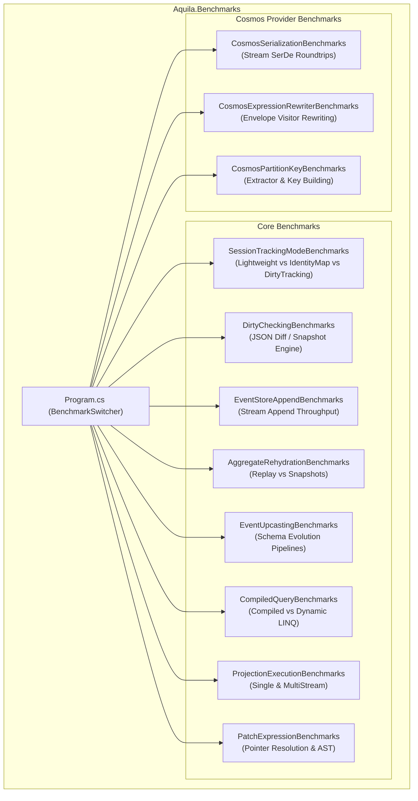

# Aquila Performance Benchmarks Suite

Comprehensive performance benchmarking suite for the **Aquila Framework** (.NET 10 Cosmos DB native document store & event sourcing engine), built with [BenchmarkDotNet](https://benchmarkdotnet.org/).

---

## Overview

The benchmarking suite measures and establishes baseline metrics for latency, throughput, and memory allocations ($0$ allocations in critical hot paths where possible) across all core subsystems in `Aquila.Core` and `Aquila.Cosmos`.



---

## Benchmark Suites

### Core Engine Benchmarks (`Aquila.Core`)

| Benchmark Suite | Source File | Description | Parameters / Scenarios |
| :--- | :--- | :--- | :--- |
| **Session Tracking Modes** | [`SessionTrackingModeBenchmarks.cs`](file:///home/chad/source/dotnet/Aquila/benchmarks/Aquila.Benchmarks/Benchmarks/Sessions/SessionTrackingModeBenchmarks.cs) | Compares `TrackingMode.Lightweight`, `TrackingMode.IdentityMap`, and `TrackingMode.DirtyTracking` | Batch sizes $N \in \{1, 10, 100\}$, Cold vs Warm `LoadAsync` hits |
| **Dirty Checking & Snapshots** | [`DirtyCheckingBenchmarks.cs`](file:///home/chad/source/dotnet/Aquila/benchmarks/Aquila.Benchmarks/Benchmarks/Sessions/DirtyCheckingBenchmarks.cs) | Evaluates UTF-8 JSON snapshotting and change-detection diff overhead | 0%, 50%, and 100% mutation ratios across small and large documents |
| **Event Store Append** | [`EventStoreAppendBenchmarks.cs`](file:///home/chad/source/dotnet/Aquila/benchmarks/Aquila.Benchmarks/Benchmarks/Events/EventStoreAppendBenchmarks.cs) | Measures stream creation, append throughput, and direct SPI storage provider calls | Batch sizes $N \in \{5, 50, 200\}$ events |
| **Aggregate Rehydration** | [`AggregateRehydrationBenchmarks.cs`](file:///home/chad/source/dotnet/Aquila/benchmarks/Aquila.Benchmarks/Benchmarks/Events/AggregateRehydrationBenchmarks.cs) | Compares full stream event replay against snapshot-accelerated rehydration (`SnapshotEvery(50)`) | Stream lengths $N \in \{10, 50, 200, 500\}$ |
| **Event Upcasting** | [`EventUpcastingBenchmarks.cs`](file:///home/chad/source/dotnet/Aquila/benchmarks/Aquila.Benchmarks/Benchmarks/Events/EventUpcastingBenchmarks.cs) | Evaluates schema evolution overhead in stream fetching | Identity (no-op), single-step (V1 $\rightarrow$ V2), chained (V1 $\rightarrow$ V2 $\rightarrow$ V3) |
| **Compiled Query Execution** | [`CompiledQueryBenchmarks.cs`](file:///home/chad/source/dotnet/Aquila/benchmarks/Aquila.Benchmarks/Benchmarks/Queries/CompiledQueryBenchmarks.cs) | Evaluates `CompiledQueryCache` vs ad-hoc dynamic LINQ expressions | Cold cache miss compilation vs steady-state cache hit |
| **Projection Execution** | [`ProjectionExecutionBenchmarks.cs`](file:///home/chad/source/dotnet/Aquila/benchmarks/Aquila.Benchmarks/Benchmarks/Projections/ProjectionExecutionBenchmarks.cs) | Measures fold performance for single-stream and multi-stream read models | Single event apply, 100-event single-stream fold, multi-stream batch routing |
| **Patch Expressions** | [`PatchExpressionBenchmarks.cs`](file:///home/chad/source/dotnet/Aquila/benchmarks/Aquila.Benchmarks/Benchmarks/Patching/PatchExpressionBenchmarks.cs) | Evaluates JSON pointer path AST walking and patch operation generation | `Set`, `Increment`, `Append`, `Remove`, nested properties, compound patches |

### Cosmos DB Provider Benchmarks (`Aquila.Cosmos`)

| Benchmark Suite | Source File | Description | Parameters / Scenarios |
| :--- | :--- | :--- | :--- |
| **Cosmos Serialization** | [`CosmosSerializationBenchmarks.cs`](file:///home/chad/source/dotnet/Aquila/benchmarks/Aquila.Benchmarks/Benchmarks/Cosmos/CosmosSerializationBenchmarks.cs) | Measures `AquilaCosmosJsonSerializer.ToStream<T>` and `FromStream<T>` roundtrip latency and heap allocations | Small document envelopes vs large nested document envelopes |
| **LINQ Expression Rewriting** | [`CosmosExpressionRewriterBenchmarks.cs`](file:///home/chad/source/dotnet/Aquila/benchmarks/Aquila.Benchmarks/Benchmarks/Cosmos/CosmosExpressionRewriterBenchmarks.cs) | Rewrites predicate expressions from `DocumentEnvelope<T>` to `CosmosDocumentEnvelope<T>` | Simple equality, multi-clause AND/OR predicates, nested member expressions |
| **Partition Key Construction** | [`CosmosPartitionKeyBenchmarks.cs`](file:///home/chad/source/dotnet/Aquila/benchmarks/Aquila.Benchmarks/Benchmarks/Cosmos/CosmosPartitionKeyBenchmarks.cs) | Evaluates `CosmosPartitionKeyHelper` parsing and `PartitionKeyBuilder` | Single-part, 2-part, 3-part, and 4-part hierarchical keys |

---

## Running Benchmarks

### 1. Interactive Selection
Run without arguments to display an interactive menu of all available benchmark suites:

```bash
dotnet run --project benchmarks/Aquila.Benchmarks/Aquila.Benchmarks.csproj -c Release
```

### 2. Filtering by Category or Name
Filter specific benchmark classes or methods using `--filter`:

```bash
# Run only Compiled Query benchmarks
dotnet run --project benchmarks/Aquila.Benchmarks/Aquila.Benchmarks.csproj -c Release -- --filter *CompiledQuery*

# Run only Cosmos Provider benchmarks
dotnet run --project benchmarks/Aquila.Benchmarks/Aquila.Benchmarks.csproj -c Release -- --filter *Cosmos*

# Run only Session & Dirty Tracking benchmarks
dotnet run --project benchmarks/Aquila.Benchmarks/Aquila.Benchmarks.csproj -c Release -- --filter *Session* *Dirty*

# Run only Event Store & Rehydration benchmarks
dotnet run --project benchmarks/Aquila.Benchmarks/Aquila.Benchmarks.csproj -c Release -- --filter *Event* *Aggregate*
```

### 3. Fast Validation / Dry Run
Use `--job short` or `--job dry` for quick validation runs:

```bash
dotnet run --project benchmarks/Aquila.Benchmarks/Aquila.Benchmarks.csproj -c Release -- --filter *PartitionKey* --job short
```

### 4. Exporting Reports
BenchmarkDotNet is configured to output GitHub-flavored Markdown reports directly to `./BenchmarkDotNet.Artifacts/results/`:
- **Markdown report**: `*report-github.md`

### 5. Automated Runner & Baseline Comparison Workflow
The runner script in `scripts/run-benchmarks.py` automates running benchmarks, preserving the baseline document, calculating delta comparisons (latency % and allocation changes), and producing timestamped report files under `docs/benchmarks/RUN_YYYYMMDD_HHMMSS.md`:

```bash
# Run benchmarks, compare against BASELINE.md, and create a timestamped report
python3 scripts/run-benchmarks.py

# Run a specific benchmark suite
python3 scripts/run-benchmarks.py --filter *Cosmos*

# Fast dry-run validation
python3 scripts/run-benchmarks.py --dry-run

# Re-aggregate and compare existing results without re-running dotnet
python3 scripts/run-benchmarks.py --aggregate-only

# Explicitly update/overwrite the master baseline (docs/benchmarks/BASELINE.md)
python3 scripts/run-benchmarks.py --set-baseline
```

---

## Baseline Performance Documentation

- **Master Baseline**: [`docs/benchmarks/BASELINE.md`](file:///home/chad/source/dotnet/Aquila/docs/benchmarks/BASELINE.md) — Preserved reference baseline across all 11 benchmark suites.
- **Run Reports**: `docs/benchmarks/RUN_YYYYMMDD_HHMMSS.md` — Timestamped execution reports with automated $\Delta$ latency and memory comparison tables.

---

## Diagnostics & Memory Profiling

All benchmarks in this suite include:
- `[MemoryDiagnoser]`: Measures Gen0, Gen1, Gen2 garbage collections and total heap bytes allocated.
- `[Orderer(SummaryOrderPolicy.FastestToSlowest)]`: Sorts results by median latency for instant readability.
- `[RankColumn]`: Annotates relative performance tiers.

