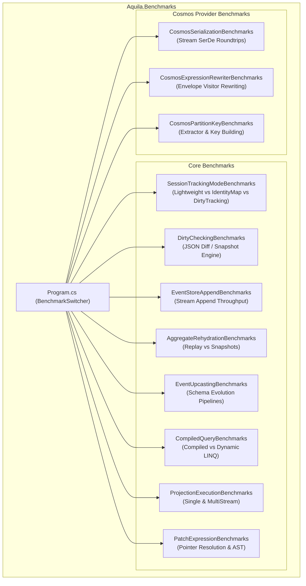

# Implementation Plan - Performance Benchmarking Suite for Aquila

## Goal Description
Establish a comprehensive, automated performance benchmarking suite using **BenchmarkDotNet** for the **Aquila Framework** (.NET 10). The suite will measure and establish baseline metrics for latency, throughput, and memory allocations across all critical hot paths in `Aquila.Core` and `Aquila.Cosmos`, enabling data-driven optimization and regression detection.



---

## User Review Required

> [!NOTE]
> We will use `BenchmarkDotNet` version `0.15.8` targeting `net10.0`. The project will be placed in `benchmarks/Aquila.Benchmarks/` and added to `Aquila.slnx` under the `/benchmarks/` solution folder.

> [!TIP]
> All benchmarks will include `[MemoryDiagnoser]`, `[Orderer(SummaryOrderPolicy.FastestToSlowest)]`, and `[RankColumn]` to profile both execution time and heap allocations ($0$ allocations in hot paths where possible).

---

## Proposed Changes

### Solution & Project Structure

#### [NEW] [Aquila.Benchmarks.csproj](../benchmarks/Aquila.Benchmarks/Aquila.Benchmarks.csproj)
- Target framework: `net10.0`
- `OutputType`: `Exe`
- `IsPackable`: `false`
- `PackageReference`: `BenchmarkDotNet` (0.15.8)
- `ProjectReference`: `..\..\src\Aquila.Core\Aquila.Core.csproj`, `..\..\src\Aquila.Cosmos\Aquila.Cosmos.csproj`

#### [MODIFY] [Aquila.slnx](../Aquila.slnx)
- Add `/benchmarks/` solution folder containing `benchmarks/Aquila.Benchmarks/Aquila.Benchmarks.csproj`.

---

### Entry Point & CLI Configuration

#### [NEW] [Program.cs](../benchmarks/Aquila.Benchmarks/Program.cs)
- Entrypoint with `BenchmarkSwitcher.FromAssembly(typeof(Program).Assembly).Run(args);`
- Supports interactive selection or command-line filtering (e.g. `--filter *Session*`, `--filter *Rehydration*`).

---

### Domain Models for Benchmarking

#### [NEW] [BenchmarkModels.cs](../benchmarks/Aquila.Benchmarks/Models/BenchmarkModels.cs)
Realistic document and aggregate models covering various object graph complexities:
- `OrderDocument`: Document with line items, address, status, and metadata.
- `CustomerProfileDocument`: Simpler flat document.
- `OrderCreated`, `OrderLineItemAdded`, `OrderDiscountApplied`, `OrderStatusUpdated`: Events for stream append & rehydration.
- `OrderAggregate`: Aggregate with state mutations on applied events.
- `OrderSummaryProjection`: Single-stream projection.
- `UserOrdersProjection`: Multi-stream projection.

---

### Core Benchmark Suites

#### [NEW] [SessionTrackingModeBenchmarks.cs](../benchmarks/Aquila.Benchmarks/Benchmarks/Sessions/SessionTrackingModeBenchmarks.cs)
- **Scenarios**:
  - `Store` + `SaveChangesAsync` with batch sizes $N \in \{1, 10, 100\}$ across:
    - `TrackingMode.Lightweight`
    - `TrackingMode.IdentityMap`
    - `TrackingMode.DirtyTracking`
  - `LoadAsync` across tracking modes (measuring identity map cache hits vs storage lookups).

#### [NEW] [DirtyCheckingBenchmarks.cs](../benchmarks/Aquila.Benchmarks/Benchmarks/Sessions/DirtyCheckingBenchmarks.cs)
- **Scenarios**:
  - `SnapshotDocument` baseline serialization overhead.
  - Change detection diff check when $0\%$ of tracked documents are mutated (clean pass).
  - Change detection diff check when $50\%$ and $100\%$ of tracked documents are mutated.
  - Diffing across small vs large documents.

#### [NEW] [EventStoreAppendBenchmarks.cs](../benchmarks/Aquila.Benchmarks/Benchmarks/Events/EventStoreAppendBenchmarks.cs)
- **Scenarios**:
  - Appending event batches $N \in \{5, 50, 200\}$ to an existing stream.
  - `StartStream` initialization + append overhead.

#### [NEW] [AggregateRehydrationBenchmarks.cs](../benchmarks/Aquila.Benchmarks/Benchmarks/Events/AggregateRehydrationBenchmarks.cs)
- **Scenarios**:
  - Rehydrating `OrderAggregate` from event streams of size $N \in \{10, 50, 200, 500\}$ without snapshots.
  - Rehydrating `OrderAggregate` from stream with snapshotting enabled (`SnapshotEvery(50)`).
  - Measures speedup factor of snapshots on long streams.

#### [NEW] [EventUpcastingBenchmarks.cs](../benchmarks/Aquila.Benchmarks/Benchmarks/Events/EventUpcastingBenchmarks.cs)
- **Scenarios**:
  - Event dispatch with no upcasting (identity).
  - 1-step upcaster conversion (V1 -> V2).
  - Multi-step chained upcaster conversion (V1 -> V2 -> V3).

#### [NEW] [CompiledQueryBenchmarks.cs](../benchmarks/Aquila.Benchmarks/Benchmarks/Queries/CompiledQueryBenchmarks.cs)
- **Scenarios**:
  - Ad-hoc LINQ expression querying via `Queryable.Where(...)`.
  - Compiled query execution via `ICompiledQuery<TDoc, TResult>` and `CompiledQueryCache.Execute`.
  - First execution (compilation & caching) vs steady-state cache hit.

#### [NEW] [ProjectionExecutionBenchmarks.cs](../benchmarks/Aquila.Benchmarks/Benchmarks/Projections/ProjectionExecutionBenchmarks.cs)
- **Scenarios**:
  - `SingleStreamProjection<T>` event handler invocation and state folding.
  - `MultiStreamProjection<TDoc, TId>` multi-stream routing and document updates.

#### [NEW] [PatchExpressionBenchmarks.cs](../benchmarks/Aquila.Benchmarks/Benchmarks/Patching/PatchExpressionBenchmarks.cs)
- **Scenarios**:
  - Building single operation `PatchExpression<T>.Set(...)`.
  - Building multi-operation `PatchExpression<T>` (`Set`, `Increment`, `Append`, `Remove`).
  - Expression tree walking and JSON pointer path generation `/Data/Property`.

---

### Cosmos Provider Benchmark Suites

#### [NEW] [CosmosSerializationBenchmarks.cs](../benchmarks/Aquila.Benchmarks/Benchmarks/Cosmos/CosmosSerializationBenchmarks.cs)
- **Scenarios**:
  - `AquilaCosmosJsonSerializer.ToStream<T>` and `FromStream<T>` roundtrip for small and large document envelopes.
  - Stream memory allocations and memory stream buffer management.

#### [NEW] [CosmosExpressionRewriterBenchmarks.cs](../benchmarks/Aquila.Benchmarks/Benchmarks/Cosmos/CosmosExpressionRewriterBenchmarks.cs)
- **Scenarios**:
  - Predicate expression rewriting from `DocumentEnvelope<T>` to `CosmosDocumentEnvelope<T>` across simple and complex composite lambda trees.

---

### Documentation

#### [NEW] [benchmarks/README.md](../benchmarks/README.md)
- Guide on how to run benchmarks locally, filter by category, and generate HTML / markdown reports.

---

## Verification Plan

### Automated Build & Test
1. Build the entire solution including `Aquila.Benchmarks`:
   ```bash
   dotnet build Aquila.slnx -c Release
   ```
2. Verify existing unit and integration test suite remains passing:
   ```bash
   dotnet test Aquila.slnx -c Release
   ```
3. Dry-run a short benchmark run using the BenchmarkDotNet filter in short-run / dry mode:
   ```bash
   dotnet run --project benchmarks/Aquila.Benchmarks/Aquila.Benchmarks.csproj -c Release -- --filter *CompiledQuery* --job short
   ```

### Manual Verification
- Verify generated benchmark reports under `BenchmarkDotNet.Artifacts/` (markdown & summary output).
