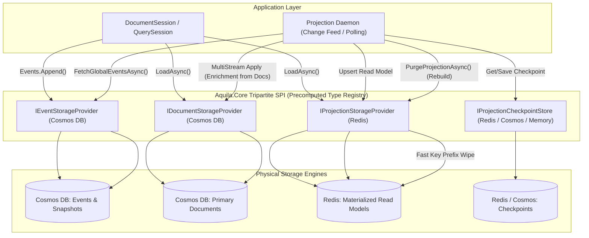

# Implementation Plan: Tripartite Storage Architecture & Redis Projection Store for Aquila

## Goal Description
Evolve Aquila from a dual-store SPI (`DocumentStorage` + `EventStorage`) into a **tripartite polyglot storage architecture** featuring three first-class, independent SPI contracts:
1. **`IEventStorageProvider`**: Append-only event streams, aggregate rehydration, global sequences, snapshots (e.g. Azure Cosmos DB, EventStoreDB, PostgreSQL).
2. **`IDocumentStorageProvider`**: Primary domain documents, dirty tracking, units of work, optimistic concurrency, and complex LINQ querying (e.g. Azure Cosmos DB, PostgreSQL).
3. **`IProjectionStorageProvider`**: Materialized read models, point views, high-throughput batch updates, native instantaneous zero-RU rebuilds, and ultra-low latency reads (e.g. **Redis**, dedicated Cosmos DB read containers).

In addition, implement the dedicated **`Aquila.Redis`** package (`net10.0`) providing `RedisProjectionStorageProvider`, `RedisDocumentStorageProvider`, and `RedisProjectionCheckpointStore`.



---

## Architectural Decisions & Guardrails

> [!IMPORTANT]
> **1. Fail-Fast Validation on Polyglot Inline Projections**:
> When `ProjectionStorage` and `EventStorage` reside on distinct physical backends (e.g., Cosmos DB + Redis), `ProjectionLifecycle.Inline` is **strictly forbidden**. Attempting to configure an inline projection in a polyglot setup throws an `InvalidOperationException` during `StoreOptions.Freeze()` with clear remediation instructions. Polyglot projections must use `ProjectionLifecycle.Async` or `ProjectionLifecycle.Live`.

> [!TIP]
> **2. Full LINQ-Capable Projection SPI**:
> `IProjectionStorageProvider` extends `IDocumentStorageProvider` with native projection management (`PurgeProjectionAsync`), supporting point reads (`LoadAsync<T>`), paged LINQ queries (`QueryPagedAsync<T>`), and reactive streaming (`StreamAsync<T>`).

> [!NOTE]
> **3. Unified Session API with $O(1)$ Zero-Allocation Routing**:
> Developers interact exclusively with standard session APIs (`session.LoadAsync<T>()`, `session.QueryAsync<T>()`, `session.Store<T>()`). On store freeze, an immutable `FrozenSet<Type>` / type registry maps projection read models to `ProjectionStorage` and domain documents to `DocumentStorage`.

> [!NOTE]
> **4. Independent Checkpoint Store**:
> `IProjectionCheckpointStore` remains an independent pluggable SPI that can be placed in Redis (`RedisProjectionCheckpointStore`), Cosmos DB (`DocumentStorageProjectionCheckpointStore`), or In-Memory independently of where read models land.

> [!TIP]
> **5. Cross-Store Enrichment in Projections**:
> Multi-stream projections have access to query primary documents (`IDocumentStorageProvider`) via the session during event processing while persisting projected views to `IProjectionStorageProvider`.

---

## Proposed Changes

```
Aquila/
├── src/
│   ├── Aquila.Core/
│   │   ├── Storage/
│   │   │   ├── StorageContracts.cs                  # [MODIFY] Add IProjectionStorageProvider interface with PurgeProjectionAsync
│   │   │   └── InMemoryStorageProvider.cs           # [MODIFY] Implement IProjectionStorageProvider on InMemory provider
│   │   ├── Configuration/
│   │   │   ├── StoreOptions.cs                      # [MODIFY] Add ProjectionStorage property, polyglot validation in Freeze()
│   │   │   ├── StoreMetadata.cs                     # [MODIFY] Expose ProjectionStorageProvider in metadata
│   │   │   └── IStoreMetadata.cs                    # [MODIFY] Expose ProjectionStorageProvider property
│   │   ├── Sessions/
│   │   │   ├── QuerySession.cs                      # [MODIFY] O(1) type routing between DocumentStorage & ProjectionStorage
│   │   │   └── DocumentSession.cs                   # [MODIFY] Split pending operations by target provider in SaveChangesAsync
│   │   └── Projections/
│   │       ├── SingleStreamProjection.cs            # [MODIFY] Route read-model writes to ProjectionStorage
│   │       ├── MultiStreamProjection.cs             # [MODIFY] Route read-model writes/deletes to ProjectionStorage
│   │       └── Daemon/
│   │           └── ProjectionDaemon.cs              # [MODIFY] Use PurgeProjectionAsync for zero-RU rebuilds
│   ├── Aquila.Cosmos/
│   │   ├── Storage/
│   │   │   ├── CosmosStorageProvider.cs             # [MODIFY] Implement IProjectionStorageProvider
│   │   │   └── CosmosProjectionStorageProvider.cs   # [NEW] Dedicated Cosmos IProjectionStorageProvider implementation
│   │   ├── Configuration/
│   │   │   └── CosmosStorageOptions.cs              # [MODIFY] Separate Document, Event, and Projection configuration
│   │   ├── Extensions/
│   │   │   └── ServiceCollectionExtensions.cs       # [MODIFY] Add UseCosmosProjections, UseCosmosEvents, UseCosmosDocuments
│   │   └── Projections/
│   │       └── CosmosProjectionDaemon.cs            # [MODIFY] Invoke PurgeProjectionAsync on rebuild
│   ├── Aquila.Redis/                                # [NEW PROJECT] Dedicated Redis provider for Aquila
│   │   ├── Aquila.Redis.csproj                      # [NEW] net10.0 project with StackExchange.Redis
│   │   ├── Configuration/
│   │   │   └── RedisStorageOptions.cs               # [NEW] Connection, keyspace prefix, database index, key formatters
│   │   ├── Storage/
│   │   │   ├── RedisDocumentStorageProvider.cs      # [NEW] IDocumentStorageProvider implementation on Redis
│   │   │   ├── RedisProjectionStorageProvider.cs    # [NEW] IProjectionStorageProvider implementation with PurgeProjectionAsync
│   │   │   └── RedisProjectionCheckpointStore.cs    # [NEW] IProjectionCheckpointStore implementation on Redis
│   │   └── Extensions/
│   │       └── RedisServiceCollectionExtensions.cs  # [NEW] UseRedis, UseRedisProjections, UseRedisCheckpoints extensions
│   └── Aquila.Samples/                              # [MODIFY] Add polyglot Cosmos + Redis sample demo
├── tests/
│   ├── Aquila.Core.Tests/
│   │   ├── Storage/
│   │   │   └── TripartiteStorageRoutingTests.cs     # [NEW] Tests for DocumentStorage vs ProjectionStorage routing & validation
│   │   └── Projections/
│   │       └── PolyglotProjectionValidationTests.cs # [NEW] Test fail-fast validation on inline polyglot projections
│   ├── Aquila.Cosmos.Tests/
│   │   └── Projections/
│   │       └── CosmosProjectionStorageTests.cs      # [NEW] Tests for Cosmos projection purge and segregation
│   └── Aquila.Redis.Tests/                          # [NEW PROJECT] Tests for Redis provider
│       ├── Aquila.Redis.Tests.csproj                # [NEW] Test project with xUnit, Shouldly, Testcontainers.Redis
│       ├── Storage/
│       │   ├── RedisDocumentStorageProviderTests.cs # [NEW] Point reads, writes, deletes, batching, queries
│       │   ├── RedisProjectionStorageProviderTests.cs# [NEW] Projection storage and purge tests
│       │   └── RedisProjectionCheckpointStoreTests.cs# [NEW] Checkpoint persistence tests
│       └── Integration/
│           └── CosmosRedisPolyglotIntegrationTests.cs# [NEW] End-to-end: Cosmos events + Redis projections + Daemon + Rebuild
└── Aquila.slnx                                      # [MODIFY] Register Aquila.Redis and Aquila.Redis.Tests projects
```

---

### Component 1: `Aquila.Core` Tripartite SPI Contracts

#### `[MODIFY]` `src/Aquila.Core/Storage/StorageContracts.cs`
Add `IProjectionStorageProvider`:
```csharp
/// <summary>
/// Provider interface for underlying projection read-model persistence.
/// Extends <see cref="IDocumentStorageProvider"/> with projection-lifecycle operations.
/// </summary>
public interface IProjectionStorageProvider : IDocumentStorageProvider
{
    /// <summary>
    /// Purges all materialized read-model documents for the specified projection, enabling instantaneous rebuilds.
    /// </summary>
    Task PurgeProjectionAsync(string projectionName, Type readModelType, CancellationToken ct = default);
}
```

#### `[MODIFY]` `src/Aquila.Core/Configuration/StoreOptions.cs`
```csharp
public sealed class StoreOptions
{
    private IDocumentStorageProvider _documentStorage = new InMemoryStorageProvider();
    private IEventStorageProvider _eventStorage = new InMemoryStorageProvider();
    private IProjectionStorageProvider _projectionStorage = new InMemoryStorageProvider();
    private FrozenSet<Type>? _projectionReadModelTypes;

    public IDocumentStorageProvider DocumentStorage
    {
        get => _documentStorage;
        set { AssertNotFrozen(); _documentStorage = value ?? throw new ArgumentNullException(nameof(value)); }
    }

    public IEventStorageProvider EventStorage
    {
        get => _eventStorage;
        set { AssertNotFrozen(); _eventStorage = value ?? throw new ArgumentNullException(nameof(value)); }
    }

    public IProjectionStorageProvider ProjectionStorage
    {
        get => _projectionStorage;
        set { AssertNotFrozen(); _projectionStorage = value ?? throw new ArgumentNullException(nameof(value)); }
    }

    public bool IsProjectionReadModel(Type type) =>
        _projectionReadModelTypes != null && _projectionReadModelTypes.Contains(type);

    public void Freeze()
    {
        if (_isFrozen) return;

        // 1. Precompute immutable projection type registry for O(1) routing
        var types = new HashSet<Type>();
        foreach (var proj in Projections.Projections)
        {
            if (proj is IMultiStreamProjection multi)
            {
                types.Add(multi.ReadModelType);
            }
            types.Add(proj.AggregateType);
        }
        _projectionReadModelTypes = types.ToFrozenSet();

        // 2. Fail-Fast Polyglot Inline Validation
        bool isPolyglot = !ReferenceEquals(ProjectionStorage, EventStorage);
        if (isPolyglot)
        {
            foreach (var proj in Projections.Projections)
            {
                if (proj.Lifecycle == ProjectionLifecycle.Inline)
                {
                    throw new InvalidOperationException(
                        $"Projection '{proj.Name}' is registered with ProjectionLifecycle.Inline, but ProjectionStorage ({ProjectionStorage.ProviderName}) " +
                        $"and EventStorage ({EventStorage.ProviderName}) are different physical providers. " +
                        "Polyglot projections must use ProjectionLifecycle.Async or ProjectionLifecycle.Live to prevent distributed partial-failure dual writes without 2PC.");
                }
            }
        }

        _isFrozen = true;
    }
}
```

#### `[MODIFY]` `src/Aquila.Core/Sessions/QuerySession.cs` & `DocumentSession.cs`
Update `QuerySessionBase` and `DocumentSession` to resolve target document storage provider via precomputed type check:
```csharp
[MethodImpl(MethodImplOptions.AggressiveInlining)]
protected IDocumentStorageProvider GetStorageForType<T>() =>
    Options.IsProjectionReadModel(typeof(T)) ? Options.ProjectionStorage : Options.DocumentStorage;

[MethodImpl(MethodImplOptions.AggressiveInlining)]
protected IDocumentStorageProvider GetStorageForType(Type type) =>
    Options.IsProjectionReadModel(type) ? Options.ProjectionStorage : Options.DocumentStorage;
```
In `SaveChangesAsync()`:
- Pending operations are partitioned into document mutations and projection mutations, executing batch writes in parallel on `DocumentStorage` and `ProjectionStorage`.

---

### Component 2: `Aquila.Redis` Package (`net10.0`)

#### `[NEW]` `src/Aquila.Redis/Aquila.Redis.csproj`
```xml
<Project Sdk="Microsoft.NET.Sdk">
  <PropertyGroup>
    <TargetFramework>net10.0</TargetFramework>
    <Title>Aquila.Redis</Title>
    <Description>High-performance Redis projection storage provider, document store, and checkpoint persistence for the Aquila Document Store & Event Sourcing Framework.</Description>
  </PropertyGroup>

  <ItemGroup>
    <ProjectReference Include="..\Aquila.Core\Aquila.Core.csproj" />
  </ItemGroup>

  <ItemGroup>
    <PackageReference Include="StackExchange.Redis" Version="2.8.24" />
    <PackageReference Include="Microsoft.Extensions.DependencyInjection.Abstractions" Version="10.0.10" />
    <PackageReference Include="Microsoft.Extensions.Options" Version="10.0.10" />
    <PackageReference Include="Newtonsoft.Json" Version="13.0.4" />
  </ItemGroup>

  <ItemGroup>
    <InternalsVisibleTo Include="Aquila.Redis.Tests" />
    <InternalsVisibleTo Include="DynamicProxyGenAssembly2" />
  </ItemGroup>
</Project>
```

#### `[NEW]` `src/Aquila.Redis/Storage/RedisProjectionStorageProvider.cs`
```csharp
namespace Aquila.Redis.Storage;

public sealed class RedisProjectionStorageProvider : IProjectionStorageProvider
{
    private readonly IConnectionMultiplexer _multiplexer;
    private readonly RedisStorageOptions _options;
    private readonly RedisDocumentStorageProvider _innerDocumentProvider;

    public string ProviderName => "Redis";
    public double LastRequestCharge => 0.0;
    public double CumulativeRequestCharge => 0.0;

    public RedisProjectionStorageProvider(IConnectionMultiplexer multiplexer, RedisStorageOptions? options = null)
    {
        _multiplexer = multiplexer ?? throw new ArgumentNullException(nameof(multiplexer));
        _options = options ?? new RedisStorageOptions();
        _innerDocumentProvider = new RedisDocumentStorageProvider(multiplexer, _options);
    }

    public Task InitializeAsync(CancellationToken ct = default) => Task.CompletedTask;

    public Task<DocumentEnvelope<T>?> ReadDocumentAsync<T>(string id, string partitionKey, CancellationToken ct = default) where T : class =>
        _innerDocumentProvider.ReadDocumentAsync<T>(id, partitionKey, ct);

    public Task<IReadOnlyList<DocumentEnvelope<T>>> QueryDocumentsAsync<T>(Expression<Func<DocumentEnvelope<T>, bool>>? predicate = null, QueryOptions? options = null, CancellationToken ct = default) where T : class =>
        _innerDocumentProvider.QueryDocumentsAsync(predicate, options, ct);

    public Task<StorageQueryResult<T>> QueryPagedDocumentsAsync<T>(Expression<Func<DocumentEnvelope<T>, bool>>? predicate = null, QueryOptions? options = null, CancellationToken ct = default) where T : class =>
        _innerDocumentProvider.QueryPagedDocumentsAsync(predicate, options, ct);

    public Task UpsertDocumentAsync<T>(DocumentEnvelope<T> envelope, CancellationToken ct = default) where T : class =>
        _innerDocumentProvider.UpsertDocumentAsync(envelope, ct);

    public Task DeleteDocumentAsync<T>(string id, string partitionKey, CancellationToken ct = default) where T : class =>
        _innerDocumentProvider.DeleteDocumentAsync<T>(id, partitionKey, ct);

    public Task ExecuteBatchAsync(IEnumerable<StorageOperation> operations, CancellationToken ct = default) =>
        _innerDocumentProvider.ExecuteBatchAsync(operations, ct);

    public async Task PurgeProjectionAsync(string projectionName, Type readModelType, CancellationToken ct = default)
    {
        ArgumentException.ThrowIfNullOrWhiteSpace(projectionName);
        ArgumentNullException.ThrowIfNull(readModelType);

        var db = _multiplexer.GetDatabase(_options.Database);
        var endpoints = _multiplexer.GetEndPoints();

        foreach (var endpoint in endpoints)
        {
            var server = _multiplexer.GetServer(endpoint);
            if (!server.IsConnected || server.IsReplica) continue;

            var pattern = $"{_options.KeyPrefix}*:{readModelType.Name}:*";
            var keys = server.Keys(_options.Database, pattern).ToArray();

            if (keys.Length > 0)
            {
                foreach (var chunk in keys.Chunk(500))
                {
                    await db.KeyDeleteAsync(chunk).ConfigureAwait(false);
                }
            }
        }
    }

    public void Dispose() => _innerDocumentProvider.Dispose();
    public ValueTask DisposeAsync() => _innerDocumentProvider.DisposeAsync();
}
```

#### `[NEW]` `src/Aquila.Redis/Storage/RedisProjectionCheckpointStore.cs`
```csharp
namespace Aquila.Redis.Storage;

public sealed class RedisProjectionCheckpointStore : IProjectionCheckpointStore
{
    private readonly IConnectionMultiplexer _multiplexer;
    private readonly string _keyPrefix;
    private readonly int _database;

    public RedisProjectionCheckpointStore(IConnectionMultiplexer multiplexer, string keyPrefix = "aquila:checkpoints:", int database = 0)
    {
        _multiplexer = multiplexer ?? throw new ArgumentNullException(nameof(multiplexer));
        _keyPrefix = keyPrefix;
        _database = database;
    }

    public async Task<long> GetCheckpointAsync(string projectionName, CancellationToken ct = default)
    {
        ArgumentException.ThrowIfNullOrWhiteSpace(projectionName);
        var db = _multiplexer.GetDatabase(_database);
        var value = await db.StringGetAsync($"{_keyPrefix}{projectionName}").ConfigureAwait(false);
        return value.HasValue && long.TryParse(value, out var seq) ? seq : 0L;
    }

    public async Task SaveCheckpointAsync(string projectionName, long sequence, CancellationToken ct = default)
    {
        ArgumentException.ThrowIfNullOrWhiteSpace(projectionName);
        var db = _multiplexer.GetDatabase(_database);
        await db.StringSetAsync($"{_keyPrefix}{projectionName}", sequence).ConfigureAwait(false);
    }
}
```

#### `[NEW]` `src/Aquila.Redis/Extensions/RedisServiceCollectionExtensions.cs`
```csharp
public static class RedisServiceCollectionExtensions
{
    public static StoreOptions UseRedisProjections(this StoreOptions options, string connectionString, Action<RedisStorageOptions>? configure = null)
    {
        var redisOptions = new RedisStorageOptions();
        configure?.Invoke(redisOptions);
        var multiplexer = ConnectionMultiplexer.Connect(connectionString);
        options.ProjectionStorage = new RedisProjectionStorageProvider(multiplexer, redisOptions);
        return options;
    }

    public static StoreOptions UseRedisDocuments(this StoreOptions options, string connectionString, Action<RedisStorageOptions>? configure = null)
    {
        var redisOptions = new RedisStorageOptions();
        configure?.Invoke(redisOptions);
        var multiplexer = ConnectionMultiplexer.Connect(connectionString);
        options.DocumentStorage = new RedisDocumentStorageProvider(multiplexer, redisOptions);
        return options;
    }

    public static IServiceCollection AddRedisCheckpointStore(this IServiceCollection services, string connectionString, string keyPrefix = "aquila:checkpoints:")
    {
        services.AddSingleton<IProjectionCheckpointStore>(sp =>
        {
            var multiplexer = ConnectionMultiplexer.Connect(connectionString);
            return new RedisProjectionCheckpointStore(multiplexer, keyPrefix);
        });
        return services;
    }
}
```

---

## Verification Plan

### Automated Tests
1. **Aquila.Core Tests**:
   - `TripartiteStorageRoutingTests`:
     - Verify `LoadAsync<T>` routes to `ProjectionStorage` for registered read models, and `DocumentStorage` for domain documents.
     - Verify `QueryPagedAsync<T>` and `StreamAsync<T>` route correctly.
     - Verify `SaveChangesAsync` splits mutations into document batch and projection batch.
   - `PolyglotProjectionValidationTests`:
     - Verify `options.Freeze()` throws `InvalidOperationException` if `ProjectionLifecycle.Inline` is used when `ProjectionStorage != EventStorage`.
     - Verify `options.Freeze()` succeeds when all projections are `ProjectionLifecycle.Async` or `ProjectionLifecycle.Live`.
2. **Aquila.Redis Tests**:
   - `RedisDocumentStorageProviderTests`: CRUD, point read `< 1ms`, batch execution with pipelining, in-memory predicate filtering, continuation token paging.
   - `RedisProjectionStorageProviderTests`: `PurgeProjectionAsync` wipes keys matching `{KeyPrefix}*:{ReadModel}:*`.
   - `RedisProjectionCheckpointStoreTests`: `GetCheckpointAsync`, `SaveCheckpointAsync`, restart and recovery.
3. **End-to-End Polyglot Integration Tests** (`Aquila.Redis.Tests/Integration`):
   - Real Cosmos DB (or Cosmos test container) for Event Store.
   - Real Redis (via `Testcontainers.Redis`) for Projection Store and Checkpoint Store.
   - Append 100 events -> run `CosmosProjectionDaemon` -> assert projections materialized in Redis.
   - Test cross-store enrichment: Multi-stream projection queries `Customer` document from Cosmos DB while mutating `CustomerSummary` in Redis.
   - Test zero-downtime rebuild: `RebuildProjectionAsync<T>()` invokes `PurgeProjectionAsync`, resets Redis checkpoint, replays full event log, and asserts consistent final state in Redis.

Command to run all test suites:
```bash
dotnet test Aquila.slnx
```

### Manual Verification
- Verify sample application running with Cosmos events and Redis projection read models.
